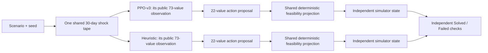

# Autonomous City Recovery Planner — PPO-v3

Autonomous City Recovery Planner is a local, synthetic-disaster research demo. It compares a learned PPO policy with a transparent public-state heuristic inside the same 30-day city-recovery simulator, then exposes both independent outcomes and both complete daily trajectories in a technical Analyst Toolbox and a 3D city view.

The shortest accurate explanation is:

> Both planners start from the same public scenario and encounter the same realized disaster sequence. Each then observes its own evolving city through the same 73-field public schema and independently proposes how to use material, crews, depot stock, and preparedness investment. A shared feasibility layer makes each proposal physically valid, the simulator advances one day, and an identical six-part rule decides whether each planner solved that disaster.

This is a sequential planning system, not a classifier. Do not describe it with a generic “accuracy” percentage. The primary benchmark is the number of synthetic disasters each planner independently **Solved** out of the same 40 sealed final cases.

## Release truth first

PPO-v3 is deliberately fail-closed. Source code, a checkpoint, or an attractive development result is not enough to make a release.

The runtime becomes ready only when all of the following agree by hash and identity:

1. the frozen scientific source and preregistered protocol;
2. a complete 645,120-transition training campaign and append-only checkpoint ledger;
3. a development-only checkpoint-selection receipt;
4. the selected ONNX actor, selected manifest, and ONNX parity receipt;
5. a write-once final-evaluation authorization; and
6. the complete, single-use 40-case final report.

Until that chain exists, `GET /api/v1/meta`, `GET /health/ready`, the V3 comparison endpoint, setup preflight, and the browser workbench return or report **dependency not ready**. They do not relabel an old model as V3 and do not substitute development numbers.

### Official final benchmark

The final report is machine-owned at `benchmarks/v3/final-40.json`. The table below is a human-readable snapshot of that sealed artifact; the JSON report and its verified provenance chain remain authoritative.

| Final metric | Release value |
| --- | --- |
| PPO-v3 independently Solved | **25 / 40 (62.5%)** |
| Public heuristic independently Solved | **14 / 40 (35.0%)** |
| Both solved / PPO only / heuristic only / neither | **14 / 11 / 0 / 15** |
| Mean resilience AUC | **PPO 0.4902262923 / heuristic 0.4685284838** |
| Secondary head-to-head resilience-AUC wins | **PPO 40 / heuristic 0 / ties 0** |
| Safety and replay invariants | **0 hard violations, 0.0 maximum conservation residual, 0 replay mismatches** |
| Final cases | **40 synthetic cases, complete** |

Inspect the canonical values directly rather than treating the copied table as an independent artifact:

```powershell
$report = Get-Content -Raw .\benchmarks\v3\final-40.json | ConvertFrom-Json
$report | Select-Object status, primary_metric, synthetic_case_count
$report.candidate
$report.baseline
$report.paired_absolute_outcomes
$report.secondary_head_to_head_resilience_auc
$report.invariants
```

This release's final report has SHA-256 `f6d3b654ca6b2831af5bec07530b81ecf0e72b2aae44029a805d98325bfe5fb3`. If that file is absent, incomplete, changed, or rejected by preflight, the copy being run is not the verified V3 release. Development-only runs and superseded releases are intentionally omitted from this portable package.

## Quick start on a fresh Windows computer

### Requirements

- 64-bit Windows 10 or Windows 11
- PowerShell
- Python **3.12**
- Node.js LTS with npm: **20.19+**, **22.12+**, or a newer even-numbered LTS release (for example, Node 24)
- an internet connection for first-time dependency installation
- a current Chrome, Edge, or Firefox browser

The release demo uses ONNX Runtime on CPU. A GPU, CUDA, Git, and `uv` are not required.

### 1. Open PowerShell in the package root

The package root is the folder containing this README, `requirements.txt`, `backend`, `frontend`, `model`, and `scripts`.

### 2. Install and verify everything

```powershell
powershell -ExecutionPolicy Bypass -File .\scripts\setup.ps1
```

Setup performs these steps:

1. finds 64-bit Python 3.12 and a supported Node.js LTS release (20.19+, 22.12+, or a newer even-numbered LTS);
2. uses Windows Package Manager (`winget`) to install a missing Python or Node runtime when possible;
3. creates an isolated Python environment in `.venv`, or in a safe short `%LOCALAPPDATA%` path if the package path is too long for Windows;
4. installs the runtime packages from `requirements.txt`;
5. installs the locked browser packages with `npm ci`;
6. builds `frontend/dist`; and
7. runs the signed V3 release preflight.

`frontend/dist` is generated from the React source, but it is also the static browser runtime served by FastAPI and is therefore required when running the packaged app. This release includes a built copy; `setup.ps1` reproducibly rebuilds it after `npm ci` so a fresh machine does not depend on stale generated files.

To prevent setup from invoking `winget`, install Python 3.12 and Node yourself, then run:

```powershell
powershell -ExecutionPolicy Bypass -File .\scripts\setup.ps1 -SkipToolBootstrap
```

An error that says V3 dependencies are not ready is not fixed by bypassing the check. It means one or more sealed release artifacts are genuinely missing or inconsistent; see [Release files and readiness](#release-files-and-readiness).

### 3. Start the app

```powershell
powershell -ExecutionPolicy Bypass -File .\scripts\run.ps1
```

Do not start `run.ps1` until setup has printed **`[setup] COMPLETE`**. If setup reports an error, resolve it and rerun setup; `run.ps1` correctly refuses to start from an incomplete environment.

For a first-time install, this paste-safe block runs setup and launches the app only when setup succeeds:

```powershell
powershell -NoProfile -ExecutionPolicy Bypass -File .\scripts\setup.ps1
if ($LASTEXITCODE -ne 0) {
    throw "Setup failed with exit code $LASTEXITCODE. Fix the setup error before starting the Toolbox."
}
powershell -NoProfile -ExecutionPolicy Bypass -File .\scripts\run.ps1
```

The launcher verifies the release, starts FastAPI at `127.0.0.1:4117`, and opens:

```text
http://127.0.0.1:4117/#/toolbox
```

Keep the PowerShell window open. Press `Ctrl+C` there to stop the server.

Use another port if `4117` is occupied:

```powershell
powershell -ExecutionPolicy Bypass -File .\scripts\run.ps1 -Port 4120
```

Start without opening a browser:

```powershell
powershell -ExecutionPolicy Bypass -File .\scripts\run.ps1 -Port 4120 -NoBrowser
```

### 4. Run a standalone release check

```powershell
powershell -ExecutionPolicy Bypass -File .\scripts\preflight.ps1
```

For an alternate port:

```powershell
powershell -ExecutionPolicy Bypass -File .\scripts\preflight.ps1 -Port 4120
```

Preflight verifies source and protocol bindings, selected artifacts, ONNX structure and inference, parity, final authorization, final benchmark integrity, the frontend build, and a real short runtime comparison. Never disable a failed hash or identity check to make the app start.

## The four different pieces

The project is easier to understand when the learned policy, baseline, simulator, and feasibility layer are kept separate.



| Piece | What it does | What it does not do |
| --- | --- | --- |
| **PPO-v3 policy** | A learned neural policy maps the current 73-value public observation to a 22-value daily intervention proposal. | It does not see future shocks, alter simulator rules, or bypass constraints. |
| **Public heuristic** | A fixed, transparent formula reacts to service gaps, priorities, stock, throughput, pending deliveries, preparedness, and public risk. | It is not trained, does not inspect PPO actions, and does not see future shocks. |
| **CityRecoveryEnv-v3** | The authored synthetic world generates shocks and advances services, depots, deliveries, roads, crews, repair, and preparedness. | It is not a learned model and is not evidence about a real city. |
| **Feasibility projector** | Deterministically converts either planner's proposal into allocations that satisfy daily bounds and conservation rules. | It is not another planner and does not choose a high-scoring strategy for the policy. |

The PPO and heuristic run in separate copies of the same environment but receive an identical shock schedule. This prevents one planner from winning because it encountered an easier random disaster.

## What one simulation represents

Every V3 case lasts exactly **30 days** and contains five service systems in this fixed order:

1. transport;
2. housing;
3. food;
4. healthcare; and
5. public services.

The case defines initial service levels, public priorities, a daily material budget, a daily crew pool, five recovery targets, hazard probability and severity bounds, and optional forced shocks. The supported hazards are aftershock, supply disruption, epidemic, utility failure, and weather.

The simulator accounts for:

- current service level and cross-service dependencies;
- material allocations and a separate non-carrying daily crew pool;
- depot stock, depot capacity, same-day delivery, pending next-day arrivals, and stock release;
- road capacity, throughput loss, depot damage, mutual aid, and food spoilage;
- repair floors, service-specific crew productivity, explicit unused material, and explicit idle crews;
- preparedness work that consumes both material and crews, decays between days, reduces shock impact, and is partly consumed when a shock occurs; and
- exact per-day logistics and conservation evidence.

Days **28–30** form the frozen three-day assessment tail. Forced shocks are rejected during those days so the final condition measures sustained recovery after the intervention period. Random shocks also respect the simulator's frozen tail semantics.

Given the same full scenario, seed, policy artifact, baseline version, and source identity, the comparison is deterministic.

## PPO-v3 model architecture

| Property | PPO-v3 value |
| --- | --- |
| Algorithm | Stable-Baselines3 Proximal Policy Optimization (PPO) |
| Observation | 73 normalized public inputs |
| Action | 22 continuous outputs |
| Actor | `73 → 384 → 256 → 128 → 22` |
| Critic | `73 → 384 → 256 → 128 → 1` |
| Hidden activation | SiLU |
| Initialization | Orthogonal |
| Training-time log standard deviation | 22 trainable values, initialized at `-2.0` |
| Total trainable parameters | **322,733** |
| Selected deployment | Deterministic actor-only ONNX, opset 17 |
| Runtime provider | ONNX Runtime `CPUExecutionProvider` |
| ONNX input / output | `observation [batch,73]` / `action [batch,22]` |

The parameter count is exact:

- actor network and action head: 162,710 parameters;
- critic network and value head: 160,001 parameters; and
- training-time action log standard deviation: 22 parameters.

Total: `162,710 + 160,001 + 22 = 322,733`.

The deployed ONNX file contains the deterministic actor needed for inference. The critic and action-distribution standard deviation are training components; their absence from actor-only deployment is expected. Parameter count describes capacity, not quality, accuracy, or proof of generalization.

## The exact 73 public inputs

Whenever a row contains five values, it uses the fixed service order `transport, housing, food, healthcare, public_services`.

| Index | Field or ordered group | Meaning |
| --- | --- | --- |
| 1–5 | `service_{service}` | Current normalized service level. |
| 6–10 | `priority_{service}` | Public scenario priority for each service. |
| 11–15 | `support_{service}` | Current dependency/support factor. |
| 16–20 | `shock_impact_{service}` | Current day's observed hazard impact. |
| 21–25 | `depot_stock_fraction_{service}` | Available depot stock relative to capacity. |
| 26–30 | `pending_arrival_pressure_{service}` | Public pressure from material already in transit. |
| 31–35 | `throughput_factor_{service}` | Current usable logistics throughput. |
| 36–40 | `depot_damage_penalty_{service}` | Current depot damage penalty. |
| 41–45 | `depot_damage_days_fraction_{service}` | Normalized remaining damage duration. |
| 46–50 | `recovery_target_{service}` | Public target the service must sustain in the assessment tail. |
| 51–55 | `prior_day_critical_streak_fraction_{service}` | Normalized length of the observed critical-service streak. |
| 56–60 | `preparedness_level_{service}` | Current stored preparedness. |
| 61 | `available_material_budget_fraction` | Today's normalized material budget. |
| 62 | `available_crew_pool_fraction` | Today's normalized crew pool. |
| 63 | `horizon_remaining_fraction` | Fraction of the 30-day horizon remaining. |
| 64 | `assessment_tail_active` | Whether the three-day assessment tail is active. |
| 65 | `current_shock_severity` | Observed severity of today's shock. |
| 66 | `road_capacity` | Current public road/logistics capacity. |
| 67 | `days_since_last_shock_fraction` | Normalized time since the latest shock. |
| 68 | `previous_weighted_resilience` | Previous day's priority-weighted resilience. |
| 69–73 | `public_next_day_risk_{aftershock,supply,epidemic,utility,weather}` | Causal public hazard-risk indicators, in the listed hazard order. |

The five public-risk values affect hazard odds but do not reveal the next random draw or future shock tape. Both planners receive the same indicators.

## The exact 22 action outputs

Again, every five-value group follows the fixed service order.

| Index | Field or ordered group | Meaning |
| --- | --- | --- |
| 1–5 | `material_share_{service}` | Relative preference for today's material allocation. |
| 6 | `material_utilization` | How much of the daily material budget the policy requests. |
| 7–11 | `crew_share_{service}` | Relative preference for today's crew allocation. |
| 12 | `crew_utilization` | How much of the daily crew pool the policy requests. |
| 13–17 | `stock_release_{service}` | Per-service gates controlling use of physically available depot stock. |
| 18–22 | `preparedness_investment_{service}` | Per-service gates that divide feasible work between preparedness and repair. |

Raw actor outputs are clipped to `[-1,1]`. Shares are decoded into positive proposal weights; utilization, release, and preparedness gates are mapped into `[0,1]`. These are proposals, not permission to violate physics.

## What the feasibility layer guarantees

PPO-v3 and the heuristic use the same action decoder and constraint code.

For material and crews separately, the projector:

1. calculates public lower and upper bounds;
2. turns the planner's share preferences into a proposal;
3. applies deterministic capped-simplex projection;
4. respects the chosen utilization gate;
5. records projection distance and binding constraints; and
6. leaves any unused material or idle crews explicit.

Preparedness cannot consume the repair floors reserved for critically damaged services. Preparedness work is limited by both physical stock and crew capacity. Repair then consumes from the remaining stock-release budget. Every transition records depot opening stock, arrivals, preparedness consumption, repair dispatch, spoilage or loss, closing stock, pending arrivals, and a conservation residual.

The projector is a guardrail, not a hidden optimizer. A poor policy can remain feasible and still fail the disaster.

## How PPO-v3 was trained

### Registered interaction budget

The frozen production budget is **645,120 PPO environment transitions** with policy seed `37017`.

| Training setting | Registered value |
| --- | --- |
| Simulator lanes | 12 |
| Vector backend | `SubprocVecEnv` with Windows `spawn` |
| Worker BLAS threads | 1 per worker |
| Steps per lane per rollout | 256 |
| Transitions per rollout | `12 × 256 = 3,072` |
| Rollouts per stage | 30 |
| Transitions per stage | `30 × 3,072 = 92,160` |
| Stages | 7 |
| Total authorized transitions | `7 × 92,160 = 645,120` |
| PPO batch size / epochs | 384 / 3 |
| Learning rate | 0.00005 |
| Discount / GAE | 0.995 / 0.95 |
| Clip range | 0.10 |
| Entropy / value coefficients | 0.001 / 0.5 |
| Maximum gradient norm | 0.5 |

The sealed production campaign completed all **645,120** registered PPO environment transitions across seven durable stages. `training/v3/training-receipt.json`, `training/v3/training-terminal.json`, and the append-only checkpoint ledger agree on that count. Development-only checkpoint selection then chose the stage-six checkpoint at **552,960 transitions**, rather than the terminal stage, because it ranked highest under the preregistered ordering. The full campaign count and selected-checkpoint count describe different facts and should both be reported.

### Public-only behavior cloning, then PPO

Training has two phases:

1. **Behavior cloning / DAgger warm start.** A deterministic public preparedness teacher supplies actions through the exact 73-field observation contract later used by PPO. It has no future-tape access. Four registered DAgger iterations use beta schedule `[1,0,0,0]`, 15 epochs per iteration, batch size 512, and learning rate 0.001.
2. **PPO interaction.** The warm-started policy continues learning from its own experience on the frozen training split for the seven registered stages.

The teacher is training infrastructure. It is neither the deployed policy nor the final comparison baseline. Its actions are not generated from final scenarios, privileged future shocks, or final outcomes.

### Role-separated scenario splits

| Split | Families × seeds | Cases | Purpose |
| --- | --- | --- | --- |
| Training | 6 × 32 (`810000–810031`) | 192 | Behavior cloning/DAgger and PPO interaction only. |
| Development | 5 × 8 (`820000–820007`) | 40 | Rank complete stage checkpoints and select exactly one deployment. |
| Final | 5 × 8 (`830000–830007`) | 40 | One authorized report after selection; never training or selection. |

The family sets and seed intervals are disjoint. Checkpoint selection first maximizes development Solved count, then development mean resilience AUC, then prefers fewer completed transitions, then uses checkpoint SHA-256 as the deterministic tie-break. The full campaign completed before selection. The selected stage-six checkpoint solved 31/40 development cases with mean resilience AUC `0.4963570975`; those development figures explain selection and are not the final benchmark.

## The public heuristic

The release baseline is `reactive-public-state-heuristic-v3` version `3.0.0`. It consumes the same 73-field public observation schema and emits the same 22-field action contract as PPO-v3. After day one, each planner's numeric observation legitimately differs because its earlier actions produced a different service, stock, delivery, and preparedness state; the exogenous shock tape remains matched.

Its fixed rules prioritize target gaps and public priorities, adjust material and crew use using visible stock, pending deliveries, and throughput, release stock reactively, and invest a bounded amount in preparedness based on public risk. It has no learned weights, no access to PPO outputs, no future tape, and no result-dependent tuning during evaluation.

This heuristic is intentionally understandable, but “transparent” does not mean “fake.” It must independently satisfy the same Solved rule and all feasibility checks. The final report preserves cases where it solves the disaster and PPO does not.

## What “Solved” means

Each planner receives its own `absolute_outcome`. A planner is Solved only if **all six** frozen checks pass:

| Check | Frozen V3 requirement |
| --- | --- |
| Assessment-tail targets | Every one of the five services is at or above its scenario-specific target on every day of days 28–30. |
| Resilience AUC | Mean priority-weighted daily resilience is at least `0.44`. |
| Critical service-days | At most 8% of 150 service-days may be below `0.30`: a maximum of **12**. |
| Hard constraints | Total hard-violation count is exactly `0`. |
| Material conservation | Maximum absolute logistics conservation residual is at most `1e-6`. |
| Terminal pipeline | Pending arrivals at each terminal depot do not exceed that depot's capacity. |

The response includes each check, each service's tail result, reason codes for failure, the exact definition ID, and the definition hash. The browser does not create its own friendlier version of Solved.

### Independent outcomes, not “winning against” the other planner

Every case belongs to exactly one pair:

- `both_solved`;
- `ppo_only`;
- `heuristic_only`; or
- `neither`.

Therefore:

```text
PPO solved count       = both_solved + ppo_only
Heuristic solved count = both_solved + heuristic_only
```

“PPO won 24 head-to-head comparisons” would not mean it solved 24 disasters. A planner can have a slightly higher AUC while both planners fail, or a lower AUC while both pass the threshold checks.

### Why resilience AUC is secondary

Resilience AUC is still useful: it summarizes the average quality of the 30-day service trajectory and can distinguish two plans with the same binary verdict. The report includes candidate wins, baseline wins, ties, both means, and their difference.

It remains secondary because it cannot replace the full terminal-target, critical-day, feasibility, and conservation definition. The primary claim is the independently measured number of disasters Solved.

## Using the Analyst Toolbox

Open `http://127.0.0.1:4117/#/toolbox` after the launcher reports ready.

### 1. Configure a case

The scenario panel controls:

- a deterministic unsigned 32-bit seed;
- case name from 1 to 64 characters;
- daily material budget from 50 to 500;
- daily crew pool from 50 to 300;
- five initial service levels from 0.05 to 0.95;
- five public priorities from 0.5 to 2.0;
- five recovery targets from 0.45 to 0.75;
- shock probability from 0 to 0.35;
- minimum shock severity from 0.05 to 0.25;
- maximum shock severity from 0.10 to 0.40 and strictly above the minimum; and
- optional forced shocks with severity from 0.05 to 0.40 on days 1–27.

The horizon is always 30 days and the assessment tail is always three days. The frontend and backend both reject forced shocks on days 28–30.

### 2. Run the paired case

Select **Run paired 30-day trace**. The backend creates one shock schedule, runs PPO-v3 and the heuristic independently, checks both outcomes, saves the canonical result, and returns both trajectories.

The top verdict cards show **Solved** or **Failed** for each planner from the backend's official outcome. They do not infer a verdict from which line is higher.

### 3. Read the signature trace

The main visualization is the paired 30-day recovery trace. It overlays both resilience curves, shared hazards, and the shaded assessment tail. Select any day to inspect the same point in both trajectories.

### 4. Use the four evidence tabs

- **Trajectory** — service levels, shocks, recovery, and daily reward.
- **Daily audit** — before/after state, material and crew use, release, preparedness, hard violations, and official outcome evidence.
- **Dispatch manifest** — stock, deliveries, physical dispatch, repair, preparedness consumption, idle resources, and conservation.
- **Decision log** — raw 22-value action, feasibility projection, planner evidence, and all 73 public inputs.

Use the PPO/heuristic toggle in the day inspector to compare like-for-like fields. The architecture section describes only the selected PPO-v3 deployment and obtains its counts and hashes from verified API metadata.

### 5. Recheck the release

The Toolbox's **Recheck release** action retries metadata. It cannot approve missing artifacts; it only reports whether the backend's verification now passes.

## Using the 3D city view

Open `http://127.0.0.1:4117/#/game` or use the Toolbox navigation.

The 3D view is a presentation of the same V3 backend comparison, not a second model or a separate scoring system. It visualizes city services, hazards, depots, vehicles, and the 30-day progression. Operator-triggered incidents are limited to the intervention window; the assessment tail remains protected. The debrief uses the same official backend Solved/Failed outcomes as the Toolbox.

If the 3D scene is slow, reduce browser zoom, close GPU-heavy tabs, or use the Toolbox, which contains the complete numerical evidence.

## HTTP API

| Method and path | Purpose |
| --- | --- |
| `GET /health/live` | Process liveness. It does not prove the V3 evidence chain is ready. |
| `GET /health/ready` | Verifies the selected V3 runtime and sealed final benchmark; returns 503 until ready. |
| `GET /api/v1/meta` | V3 model, environment, exact orders, outcome, baseline, and final benchmark metadata; fail-closed. |
| `POST /api/v1/simulations/compare` | Runs and persists one V3 PPO-versus-heuristic comparison. |
| `GET /api/v1/simulations?engine_version=city-recovery-env-v3` | Lists saved V3 run summaries. |
| `GET /api/v1/simulations/{result_id}` | Reads one canonical saved V3 result. |

Example V3 request:

```powershell
$body = @{
    seed = 424242
    scenario = @{
        name = 'Technical demo'
        horizon_days = 30
        daily_budget = 180
        initial_services = @(0.34, 0.26, 0.41, 0.38, 0.30)
        priorities = @(1.0, 1.1, 1.2, 1.4, 1.0)
        shock_probability = 0.20
        severity_min = 0.10
        severity_max = 0.28
        forced_shock = @{ day = 5; type = 'utility'; severity = 0.26 }
        forced_shocks = @()
        daily_crew_pool = 150
        recovery_targets = @(0.55, 0.55, 0.55, 0.55, 0.55)
        assessment_tail_days = 3
    }
} | ConvertTo-Json -Depth 8

Invoke-RestMethod `
    -Method Post `
    -Uri 'http://127.0.0.1:4117/api/v1/simulations/compare' `
    -ContentType 'application/json' `
    -Body $body
```

The V3 response uses schema `4.0.0`. It includes the shared shock schedule and hash, exact observation and action orders, policy and baseline identities, both planner summaries, both complete trajectories, both official outcomes, the absolute outcome pair, the secondary AUC difference, and a content-addressed `result_id`.

Saved runs default to:

```text
%LOCALAPPDATA%\Innoverse\ai17-city-recovery\runs
```

Use a separate location without changing code:

```powershell
$env:INNOVERSE_STATE_DIR = 'D:\InnoverseRuns'
powershell -ExecutionPolicy Bypass -File .\scripts\run.ps1
```

## Active folder and file map

Generated folders such as `.venv`, `.pytest_cache`, `.ruff_cache`, `frontend/node_modules`, `__pycache__`, and TypeScript build-info files are disposable build output. `frontend/dist` is reproducible build output but is also required by the packaged FastAPI runtime, so keep the shipped build or recreate it with `npm run build --prefix frontend`. The files below define or document the active package.

```text
.
├── artifacts/                    V3 production and selected model artifacts
├── backend/app/                  FastAPI, schemas, persistence, scenarios, simulator
├── benchmarks/                   Machine-generated benchmark reports
├── frontend/                     React Analyst Toolbox and 3D city
├── internal/                     Required durable V3 release evidence
├── model/                        Strict selected-V3 model loader
├── scripts/                      Setup, launch, verification, training, selection, evaluation
├── tests/                        Active Python V3 tests
├── training/v3/                  Frozen config, protocol, seal, and write-once receipts
├── .python-version               Required Python version
├── requirements.txt              Runtime Python dependencies
└── README.md                     This non-scientific operator guide
```

### Root files

| Path | Role |
| --- | --- |
| `.python-version` | Pins Python 3.12 for compatible environment managers and the scientific source seal. |
| `requirements.txt` | Exact direct dependencies for the API, simulator, and ONNX runtime. |
| `.editorconfig` | Shared text-format defaults. |
| `.gitignore` | Excludes generated environments, builds, caches, runtime state, and temporary files. |
| `README.md` | Human operator/reviewer guide. It is deliberately outside the scientific source identity. |

### `artifacts`

| Path | Role |
| --- | --- |
| `artifacts/city_recovery_ppo.v3.selected.onnx` | Shipped selected PPO-v3 deterministic actor, exported from the 552,960-transition checkpoint after development selection and parity. |
| `artifacts/model_manifest.v3.selected.json` | Shipped manifest binding ONNX, selected checkpoint, training, source, protocol, and parity identities. |
| `artifacts/city_recovery_ppo.v3.zip`, `artifacts/city_recovery_ppo.v3.onnx` | Terminal production checkpoint and actor retained as sealed campaign evidence. The runtime deploys the selected actor above. |
| `artifacts/city_recovery_ppo.v3.metadata.json`, `artifacts/model_manifest.v3.json` | Terminal production metadata and manifest bound into the completed training chain. |

Absence of either selected V3 file means the V3 release is not ready. There is no fallback model.

### `backend/app`

| Path | Role |
| --- | --- |
| `main.py` | FastAPI routes, static frontend serving, V3 fail-closed loading, metadata, and comparison orchestration. |
| `models.py` | Strict request schemas, including the fixed 30-day `ScenarioV3` contract. |
| `persistence.py` | Canonical content-addressed JSON storage for V3 operator runs. |
| `scenarios_v3.py` | Frozen training, development, and final V3 scenario-family definitions. |
| `simulator_v3.py` | V3 environment, observations, actions, public baseline and teacher, transitions, outcome, and comparison. |
| `simulator_core.py` | Shared service constants, shock mechanics, hashing, projections, and constraint measurements. |
| `simulator_v2.py` | Active, source-sealed V3 dependency that supplies depot capacity, delivery/spoilage constants, damage, transfers, and throughput mechanics reused by V3. The filename is retained because renaming it would break the frozen source identity. |
| `backend/__init__.py`, `backend/app/__init__.py` | Python package markers. |

### `model`

| Path | Role |
| --- | --- |
| `ppo_v3.py` | Strict selected-V3 loader. Cross-verifies every source, receipt, artifact, parity, and final-report binding before creating an ONNX session. |
| `__init__.py` | V3-only package exports. |

### `frontend`

| Path | Role |
| --- | --- |
| `package.json`, `package-lock.json` | Locked React/Vite/TypeScript dependency and command definitions. |
| `index.html`, `vite.config.ts`, `tsconfig*.json` | Browser entry and build configuration. |
| `src/main.tsx` | React browser bootstrap. |
| `src/App.tsx` | Main Toolbox and routing shell. |
| `src/api.ts` | Strict V3 API client and fail-closed error handling. |
| `src/types.ts` | V3 request, response, trajectory, outcome, benchmark, and metadata types. |
| `src/scenarios.ts` | Browser scenario presets and validation helpers. |
| `src/v3ViewModel.ts` | Derived presentation values that preserve official backend verdicts. |
| `src/shockPresentation.ts` | Shared hazard labels and presentation helpers. |
| `src/styles.css` | Municipal workbench visual system and responsive layout. |
| `src/api.test.ts`, `src/v3ViewModel.test.ts` | Frontend contract tests. |
| `src/game/` | 3D city, infrastructure, hazards, vehicles, quality adaptation, audio, pacing, session, and official debrief components. |

The active 3D folder contains:

| Path group | Role |
| --- | --- |
| `CityGame.tsx`, `CityScene.tsx`, `InfrastructureScene.tsx` | Game route, Three.js canvas, camera, environment, and city composition. |
| `DenseCityBuildings.tsx`, `DepotNetwork.tsx`, `VehicleFleet.tsx` | Visible buildings, depots/routes, and response vehicles. |
| `DisasterEffects.tsx`, `RecoveryPhenomenology.tsx`, `SceneEffects.tsx` | Hazard and recovery visualization driven by the selected trajectory. |
| `DisasterTray.tsx`, `StartScreen.tsx`, `RunOutcome.tsx` | Operator controls, scenario entry, and official-outcome debrief. |
| `model.ts`, `session.ts`, `pacing.ts`, `stakes.ts`, `realism.ts` | Typed game view model, run session, day pacing, presentation stakes, and visual-state mapping. None defines the scientific outcome. |
| `cameraFraming.ts`, `worldLayout.ts`, `renderQuality.ts`, `QualityMonitor.tsx` | Camera/layout calculations and adaptive rendering quality. |
| `audio.ts`, `useCityAudio.ts` | Optional local interaction and ambience audio. |
| `game.css`, `start-screen.css`, `run-outcome.css` | 3D route, entry, and debrief styling. |

### `scripts`

| Path | Role |
| --- | --- |
| `setup.ps1` | Fresh Windows dependency installation, frontend build, and release preflight. |
| `run.ps1` | Verified local FastAPI launcher and browser opener. |
| `preflight.ps1`, `preflight_check.py` | PowerShell and Python release-integrity checks. |
| `project_environment.ps1` | Resolves the package's Python 3.12 environment, including the long-path fallback. |
| `v3_protocol.py` | Creates/verifies the preregistration, source seal, and write-once authorizations. Read-only without explicit write flags. |
| `train_policy_v3.py` | Public-only BC/DAgger plus seven-stage resumable PPO training. |
| `select_policy_v3.py` | Development-only checkpoint evaluation, deterministic selection, ONNX export, and parity. |
| `evaluate_policy_v3.py` | Single-use, append-only, resumable final evaluator. |
| `benchmark_vectorization_v3.py` | Nonauthorizing training-split throughput and memory diagnostic; never model-performance evidence. |

### `training/v3`

| Path | Role |
| --- | --- |
| `config.json` | Exact 73/22 architecture, optimizer, vectorization, seed, and 645,120-transition budget. |
| `requirements-training.txt` | Stable-Baselines3 and PyTorch dependencies used by maintainers for training/evidence tools. |
| `protocol.json` | Preregistered split, checkpoint-selection, authorization, final-evaluation, and artifact contracts. |
| `source-seal.json` | Frozen per-file and semantic scientific-source hashes. |
| `training-authorization.json` | Write-once authorization for exactly one production training/selection campaign. |
| `training-use-receipt.json` | Atomic proof that the production authorization was consumed. |
| `training-receipt.json`, `training-terminal.json` | Proof that all seven stages and 645,120 production transitions completed. |
| `checkpoint-selection-receipt.json`, `selected-onnx-parity.json` | Development selection of the 552,960-transition checkpoint and selected ONNX parity proof. |
| `final-authorization.json`, `final-use-receipt.json` | Write-once authorization and atomic proof of its single permitted use. |
| `final-terminal.json` | Verified terminal marker binding the 40-row ledger, final report, selected deployment, source, and protocol. |

### `benchmarks`

| Path | Role |
| --- | --- |
| `benchmarks/v3/final-40.json` | Complete canonical V3 one-shot final aggregate; sole source of official final counts. |

### `tests`

| Path | Role |
| --- | --- |
| `test_simulator_v3.py` | Transition, observation/action, preparedness, crew, conservation, and outcome checks. |
| `test_policy_v3.py` | Architecture, parameter, export, loader, and parity checks. |
| `test_api_v3.py` | Fail-closed V3 metadata, compare endpoint, and persistence checks. |
| `test_v3_protocol.py` | Frozen split, protocol, seal, authorization, and final-unused contract checks. |
| `test_v3_evidence_tools.py` | Training, checkpoint, selection, and final-evaluator durability checks. |

### `internal`

`internal` contains only evidence required to verify this selected V3 release.

| Path | Meaning |
| --- | --- |
| `internal/training_runs/v3` | Completed append-only production checkpoint ledger, exact stage checkpoints, selection staging receipts, and 40-row final ledger. Do not edit manually. |

## Release files and readiness

A finished V3 release has, at minimum, these selected/final files in addition to the frozen inputs already present:

```text
artifacts/city_recovery_ppo.v3.selected.onnx
artifacts/model_manifest.v3.selected.json
training/v3/training-receipt.json
training/v3/training-terminal.json
training/v3/checkpoint-selection-receipt.json
training/v3/selected-onnx-parity.json
training/v3/final-authorization.json
training/v3/final-use-receipt.json
training/v3/final-terminal.json
benchmarks/v3/final-40.json
```

The exact presence of files is still not sufficient: their hashes, source identity, selected checkpoint, transition count, protocol, ONNX graph, parity, authorization, report rows, and ledger digests must cross-verify. Use `scripts/preflight.ps1` as the decision procedure.

To inspect file hashes without modifying anything:

```powershell
Get-FileHash .\training\v3\protocol.json -Algorithm SHA256
Get-FileHash .\training\v3\source-seal.json -Algorithm SHA256
Get-FileHash .\artifacts\city_recovery_ppo.v3.selected.onnx -Algorithm SHA256
Get-FileHash .\artifacts\model_manifest.v3.selected.json -Algorithm SHA256
Get-FileHash .\benchmarks\v3\final-40.json -Algorithm SHA256
```

The principal verified V3 identities are:

| Artifact or identity | SHA-256 |
| --- | --- |
| Scientific-source semantic identity | `f0fd873a075f86e418eb4841a87f964e090189eca6f04df01255aa5a3b2bb3d9` |
| Preregistered protocol file | `d512b74512dc9203bfac7e81d90245176732655d0e3ada54e3a6851fec3e3762` |
| Selected 552,960-transition checkpoint | `3246ddae65b6add700c1a4fc528d724d537e5e9d0dd453c8665b4e6c8ed86d5b` |
| Selected ONNX actor | `6a08ae284fb93cff1155ce37dcec4fac1121697add0fabd9d367486be344bf0b` |
| Final 40-case benchmark | `f6d3b654ca6b2831af5bec07530b81ecf0e72b2aae44029a805d98325bfe5fb3` |

These values document this release; recompute them from the shipped artifacts for verification. The authoritative scientific-source semantic identity remains the value recorded inside `training/v3/source-seal.json`.

## Developer verification

The launcher needs only runtime dependencies. Python tests and training/evidence tools additionally need the frozen training requirements plus test tools.

Resolve the correct environment robustly, including long Windows paths:

```powershell
. .\scripts\project_environment.ps1
$ctx = Get-CityRecoveryEnvironmentContext -Root (Get-Location).Path
& $ctx.PythonPath -m pip install -r .\training\v3\requirements-training.txt
& $ctx.PythonPath -m pip install pytest==8.4.1 ruff==0.12.4
```

Run the active Python tests and lint:

```powershell
& $ctx.PythonPath -m pytest -q tests
& $ctx.PythonPath -m ruff check backend model scripts tests
```

The active tests cover simulator, policy, API, protocol, and evidence contracts. For the shipped release, `preflight.ps1` is the authoritative end-to-end check of the consumed final evidence chain.

Run frontend tests, type checking, and production build:

```powershell
npm ci --prefix frontend
npm test --prefix frontend
npm run typecheck --prefix frontend
npm run build --prefix frontend
```

Run the registered Windows spawn/lane preflight without training:

```powershell
& $ctx.PythonPath .\scripts\train_policy_v3.py --vectorization-preflight-only
```

Run a bounded training-only vectorization diagnostic:

```powershell
& $ctx.PythonPath .\scripts\benchmark_vectorization_v3.py `
    --lanes 4 8 12 `
    --warmup-steps 4 `
    --steps 20 `
    --memory-sample-steps 2
```

That diagnostic touches the training split only and compares `DummyVecEnv` with spawned subprocess lanes. It measures throughput, memory, and deterministic digests. It is not a policy benchmark and cannot authorize a change to the frozen 12-lane geometry.

## Maintainer-only scientific pipeline

Normal demo users should not run the commands in this section. They consume write-once authorizations, publish artifacts, or access the final split.

The registered order is:

1. verify the frozen protocol and source;
2. run or resume exactly one complete production campaign at registered stage boundaries;
3. select exactly one checkpoint using development cases only;
4. create final authorization bound to that selected checkpoint;
5. invoke the final evaluator once; and
6. run release preflight.

The gated command interfaces are:

```powershell
# Read-only protocol/source verification
& $ctx.PythonPath .\scripts\v3_protocol.py

# Production training: no timestep override under the sealed authorization
& $ctx.PythonPath .\scripts\train_policy_v3.py

# Write-once development selection + selected ONNX publication
& $ctx.PythonPath .\scripts\select_policy_v3.py --write-new

# Write-once authorization after selection
& $ctx.PythonPath .\scripts\v3_protocol.py --authorize-final

# Single-use final evaluation; resumes only original identity-matching durable rows
& $ctx.PythonPath .\scripts\evaluate_policy_v3.py --run-final-once
```

Do not run `--run-final-once` to “see what happens,” do not delete an unfavorable report, and do not start a second invocation after interruption. The evaluator's append-only ledger resumes only the exact original selected model/source identity.

## Evidence and provenance chain

The V3 protocol is designed so that performance claims cannot be assembled from mismatched pieces.

1. `protocol.json` preregisters the exact source set, 73/22 contracts, training geometry, role-separated splits, selection order, final count, baseline, and outcome definition.
2. `source-seal.json` binds every scientific source file and a semantic source hash.
3. Training authorization is consumed atomically; checkpoints are published only at complete 92,160-transition boundaries, hashed, and linked in an append-only ledger.
4. Behavior-cloning data and its receipt bind the public-only teacher, training split, and replay.
5. Development evaluation ranks only complete registered checkpoints and records proof that the final split was not accessed.
6. The selected actor is exported to ONNX opset 17 and compared against the selected Stable-Baselines3 checkpoint on development trajectories.
7. Final authorization binds the selected checkpoint, ONNX, parity, source, and protocol identities.
8. The final evaluator runs the 40 final cases through the selected ONNX runtime and public heuristic on matched tapes. Every row is durable and replay-checked.
9. `final-40.json` aggregates independent outcomes, paired categories, secondary AUC, violations, conservation, row hash, and ledger hash.
10. The runtime revalidates the complete chain before exposing V3 metadata or comparison.

The scientific source seal covers the environment, schemas, scenario splits, policy loader, training, selection, evaluation, config, and requirements. This README and the frontend are intentionally non-scientific: changing presentation cannot change the sealed mechanics, model, or evidence.

### Portable package boundary

This copy retains the complete successful V3 chain required by the strict loader: production artifacts, all seven registered checkpoints, checkpoint ledger, selected-deployment staging receipts, authorizations, final-use receipt, 40-row final ledger, terminal marker, and aggregate report. Development experiments, superseded releases, launch logs, caches, and alternate model generations are deliberately not shipped.

## Troubleshooting

### `setup.ps1` says Python or Node is missing

Run setup without `-SkipToolBootstrap` so it can use `winget`, or install 64-bit Python 3.12 and a supported Node.js LTS release manually. Setup refreshes discovery and accepts a verified installation even when `winget` reports that the package is already installed, so opening a new shell should not be necessary. If an external installer is still open, let it finish and rerun the same setup command.

Check versions:

```powershell
py -3.12 --version
node --version
npm --version
```

### PowerShell blocks a script

Use the documented form, which applies the policy only to that process:

```powershell
powershell -ExecutionPolicy Bypass -File .\scripts\setup.ps1
```

### Setup or `/health/ready` reports `DEPENDENCY_NOT_READY`

Read the full message. Typical causes are missing selected V3 artifacts, absent final report, source drift, receipt/hash mismatch, wrong ONNX shape or opset, failed parity, or incomplete final rows. This is evidence protection, not a frontend bug. Restore the correct release files; do not disable the check.

### Selected V3 artifacts are missing from a copy

That copy is incomplete. Restore the shipped selected ONNX, selected manifest, receipts, final ledger, terminal marker, and benchmark together; never copy only the ONNX around the integrity checks.

### Port 4117 is already in use

```powershell
powershell -ExecutionPolicy Bypass -File .\scripts\run.ps1 -Port 4120
```

Use the same port in the browser and preflight.

### The project path is very long

The setup scripts automatically place the Python environment under `%LOCALAPPDATA%\Innoverse\city-recovery-ppo-v3` when needed. Use `project_environment.ps1` rather than assuming `.venv\Scripts\python.exe` exists.

### The frontend looks stale or is blank

Stop the server, rebuild, and restart:

```powershell
npm ci --prefix frontend
npm run build --prefix frontend
powershell -ExecutionPolicy Bypass -File .\scripts\run.ps1
```

Then hard-refresh the browser with `Ctrl+F5`. Inspect `/health/live` and `/health/ready` separately: liveness can pass while V3 release verification correctly fails.

### A forced shock is rejected

V3 accepts forced shocks only on days 1–27. Days 28–30 are the fixed assessment tail.

### Saved runs are not where expected

The default is `%LOCALAPPDATA%\Innoverse\ai17-city-recovery\runs`. Check whether `INNOVERSE_STATE_DIR` is set in the same PowerShell session that launched the app.

### The 3D view is slow but the Toolbox is responsive

The 3D route loads a much larger rendering bundle. Close other graphics-heavy tabs, update the browser, or use `#/toolbox`; all model evidence is available there without the 3D scene.

### A hash check fails after someone edited simulator or training code

Do not regenerate a manifest around unreviewed changes. The selected policy, source seal, parity, and final report describe one exact scientific identity. A scientific change requires a new version, new freeze, new training/selection evidence, and a new final protocol.

## Honest scope and limitations

- All scenarios are **synthetic and authored**. The simulator is not historical disaster ground truth, a digital twin, or operational validation.
- PPO-v3 and the heuristic are evaluated fairly inside this simulator, but success does not establish effectiveness in a real emergency.
- Training, development, and final families are disjoint, yet all are generated by the same simulator family. Simulator-specific generalization is not real-world generalization.
- The final suite contains 40 cases. Counts and confidence intervals should be reported, but the sample is not a universal performance guarantee.
- The model uses one registered policy seed. The final report evaluates one development-selected checkpoint, not an ensemble or broad study of training-seed variance.
- The official Solved definition is an authored engineering threshold. It is useful because it is explicit, independent, and frozen—not because it is a universal definition of disaster resolution.
- The public risk indicators are causal simulator signals shared by both planners. Neither sees future random draws, but both can learn or encode patterns in the authored environment.
- Feasibility projection proves compliance with the simulator's daily action and conservation contracts. It does not prove safety, legal compliance, or logistical feasibility outside this code.
- The selected ONNX policy is deterministic. Results describe that exact artifact, source identity, scenarios, baseline, and metric definition.
- The runtime and registered training configuration are CPU-based. Do not claim V3 was trained on CUDA unless a future, separately sealed version and its receipts prove that.
- This is a research demonstration, not an emergency-management recommendation system. Human authorities remain responsible for real decisions.

## How to present the project accurately

A concise presentation can say:

> We built a 322,733-parameter PPO policy for a five-service synthetic city-recovery environment. It receives 73 causal public-state inputs and chooses 22 continuous controls for material, crews, depot release, and preparedness. A deterministic feasibility layer enforces the same physical rules for PPO and a transparent public heuristic. After a complete 645,120-transition campaign, development-only selection chose the 552,960-transition checkpoint. On the sealed 40-case final suite, PPO independently solved 25 cases (62.5%) and the heuristic solved 14 (35.0%): 14 were solved by both, 11 by PPO only, none by the heuristic only, and 15 by neither. PPO's mean resilience AUC was 0.4902262923 versus 0.4685284838, with zero hard violations, zero conservation residual, and zero replay mismatches. These are synthetic-simulator results, not real-world disaster validation.

Avoid these claims:

- “The model is X% accurate.”
- “It won X/40, therefore it solved X/40.”
- “The neural network guarantees feasible actions.” The projector enforces feasibility.
- “The model predicted future disasters.” It receives causal public risk, not the future tape.
- “The simulator proves real-world impact.” It demonstrates competence on authored synthetic scenarios.
- “322,733 parameters makes it better.” Quality comes from sealed evaluation, not parameter count.

## License and data character

The API metadata identifies the synthetic V3 dataset as `synthetic-city-dynamics-v3`, schema/version-bound and non-empirical. Release model and dataset license identifiers are exposed dynamically in verified `/api/v1/meta`. Consult that endpoint and the selected manifest for the exact shipped artifact licenses.

---

For a demo operator, the safe path is: run `setup.ps1`, run `run.ps1`, use `#/toolbox`, and trust only values returned by the verified V3 API. For a reviewer, start with `training/v3/protocol.json`, `training/v3/source-seal.json`, the selected manifest, `benchmarks/v3/final-40.json`, and `scripts/preflight.ps1`.
