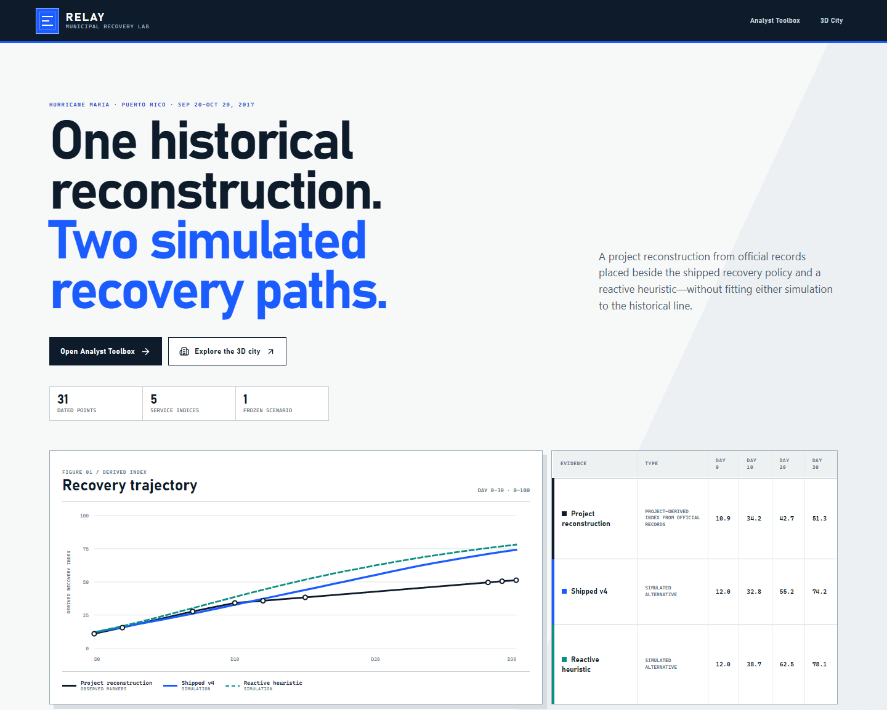

# Autonomous City Recovery Planner

A local research application for planning 30-day recovery across five city services.
A bundled PPO policy allocates material, crews, depot stock, and preparedness under the same physical rules as transparent comparison planners.
The browser shows both independent recovery traces, daily decisions, constraints, and evidence—not just a score.

## Quick Start

From a fresh Windows PowerShell in the repository root:

```powershell
powershell -ExecutionPolicy Bypass -File .\scripts\setup.ps1
powershell -ExecutionPolicy Bypass -File .\scripts\run.ps1
```

Setup installs the Python runtime, installs locked frontend packages, builds the browser, and preflights the bundled ONNX policy. The launcher opens the landing page at `http://127.0.0.1:4117/#/`; no model path or GPU is required.

Requirements: 64-bit Windows, Python 3.12, Node.js LTS, and PowerShell. Setup can bootstrap Python and Node with `winget`. See [Development](docs/DEVELOPMENT.md) for manual installation, policy overrides, and verification commands.

## What Opens

- **Analyst Toolbox** (`#/toolbox`) — configure a synthetic case, run the policy and heuristic on one shared shock tape, inspect the paired trajectory, and audit every day.
- **3D Recovery City** (`#/game`) — play the same saved comparison through districts, infrastructure, depots, vehicles, hazards, and the outcome debrief.
- **Evidence views** — trajectory, daily audit, dispatch manifest, and decision log with all 73 inputs, the raw 22-value action, feasibility projection, local sensitivity, counterfactual replay, and CSV/PDF recovery-plan exports.

The Toolbox is the numerical source of truth. The 3D route visualizes the same backend result; it does not run a second model or apply a different scoring rule.

## Hurricane Maria Reconstruction



This is a **project reconstruction from official records**. The dated historical service series and aggregate index are a disclosed reconstruction built from official observations, conversions, project estimates, and linear interpolation. The shipped v4 and reactive-heuristic paths are simulation outputs—not observed measurements, causal estimates, or claims about actual operational decisions.

Read the [full Hurricane Maria retrospective](benchmarks/v4/hurricane-maria-retrospective.md) or inspect its [machine-readable record](internal/retrospectives/hurricane-maria-30d.json).

## Measured Synthetic Results

The shipped artifact was selected on 200 development cases at **178 / 200**, then frozen. Exactly one owner-authorized learned-policy evaluation was run on the disjoint 200-case final roster; it solved **163 / 200 (81.5%)**, 16 more cases than the strongest hand-coded planner.

| Final method | Raw solved / 200 | Ratio to 182 oracle-solved cases | Descriptive Wilson 95% CI on /182 | Scope |
| --- | ---: | ---: | ---: | --- |
| Privileged future-aware CEM | **182 / 200** | **182 / 182 = 100.0%** | **[0.9793, 1.0000]** | Anytime oracle-solved reference; not a submission baseline |
| **Shipped v4 PPO** | **163 / 200** | **163 / 182 = 89.6%** | **[0.8427, 0.9321]** | Single owner-authorized learned-policy evaluation |
| Tuned constant rule | **147 / 200** | **147 / 182 = 80.8%** | **[0.7443, 0.8584]** | Public deterministic planner |
| Preparedness teacher | **139 / 200** | **139 / 182 = 76.4%** | **[0.6970, 0.8196]** | Public deterministic planner |
| Causal MPC, `k=5` | **135 / 200** | **135 / 182 = 74.2%** | **[0.6736, 0.7999]** | Receding-horizon diagnostic |
| Legacy ONNX fixture | **125 / 200** | **125 / 182 = 68.7%** | **[0.6162, 0.7497]** | Retired-policy regression fixture |
| Reactive heuristic | **72 / 200** | **72 / 182 = 39.6%** | **[0.3274, 0.4681]** | Runtime public baseline |

The denominator of the benchmark remains 200. The additional `/182` column is an **oracle-solved reference**: privileged CEM found solutions for 182 cases while seeing the complete future shock tape. It is an anytime achieved lower bound, not a proof that the other 18 cases are infeasible and not a mathematical ceiling.

The policy and oracle solved sets are not nested: **162 both solved, 1 policy-only, 20 oracle-only, and 17 neither**. Their union is **183 / 200**; casewise policy coverage of oracle-solved cases is **162 / 182 = 89.0%**, which is distinct from the aggregate **163 / 182 = 89.6%** ratio. Every bound final row has zero hard violations and exactly `0.0` maximum conservation residual.

See [Evidence and Results](docs/EVIDENCE.md) for the development sweep, family results, historical subset, post-release studies, confidence-interval boundary, and receipt map.

## How One Decision Becomes a Result

1. Each day, the environment exposes **73 causal public-state inputs**: services, priorities, dependencies, observed impacts, logistics, targets, preparedness, budget, time, and public next-day risk.
2. The deterministic ONNX actor maps that vector to **22 bounded proposals** for material shares and use, crew shares and use, depot release, and preparedness investment.
3. A shared deterministic feasibility projector converts proposals into physically valid allocations; it is a guardrail, not a hidden optimizer.
4. The policy and public heuristic run in independent environment copies while encountering the same pre-generated shock tape.
5. The simulator advances services, stock, deliveries, roads, crews, repair, and preparedness for exactly **30 days**.
6. Days 28–30 are a frozen assessment tail; forced shocks are rejected there.
7. A planner is **Solved** only if all six checks pass: tail targets, resilience AUC, critical service-days, zero hard violations, material conservation, and terminal pipeline capacity.
8. The API persists both full trajectories and their identities, so the browser can replay decisions without recomputing a friendlier verdict.

The environment is synthetic and deterministic for a fixed scenario, seed, policy artifact, baseline version, and source identity. The policy never sees future random draws. The exact observation/action tables, projection rules, Solved thresholds, and worked example are in [Evidence and Results](docs/EVIDENCE.md).

## Runtime, API, and Documentation

| Need | Start here |
| --- | --- |
| Architecture and reading order | [Code Tour](docs/CODE_TOUR.md) |
| Setup, tests, training, and policy overrides | [Development](docs/DEVELOPMENT.md) |
| Results, definitions, receipts, and evidence boundaries | [Evidence and Results](docs/EVIDENCE.md) |
| Publication gates for the shipped policy | [Training Deployment Plan](docs/TRAINING_DEPLOYMENT_PLAN.md) |
| Operational problems | [Troubleshooting](docs/TROUBLESHOOTING.md) |

The repository bundles `artifacts/city_recovery_ppo.v4.onnx` as the zero-configuration policy. Runtime precedence is explicit `-PolicyPath`, then nonblank `INNOVERSE_POLICY_PATH`, then the bundle; invalid higher-priority choices fail closed. `GET /health/live` checks the process, while `GET /health/ready` loads the selected bytes and validates the `observation[batch,73] → action[batch,22]` CPU contract.

Key endpoints:

- `GET /api/v1/meta` — selected policy, environment, orders, outcome definition, baseline, persistence, and determinism metadata.
- `POST /api/v1/simulations/compare` — run and persist one policy-versus-heuristic comparison on a shared tape.
- `GET /api/v1/simulations/{result_id}` — retrieve the canonical saved result.
- `GET /api/v1/simulations/{result_id}/explanations` — replay-verified local action sensitivity.
- `POST /api/v1/simulations/{result_id}/counterfactuals` — replace one day's allocation shares and replay thereafter.
- `GET /api/v1/simulations/{result_id}/recovery-plan` — deterministic CSV or PDF export.

## Evidence and Reproducibility Boundary

- Canonical rosters are disjoint: **192 training**, **200 development**, and **200 final** cases.
- Development selection chose seed `67017` at 1M active actor-critic transitions with **178 / 200**; full SB3-to-ONNX parity and the 200-case FastAPI `POST → persist → GET` replay reproduced all 178 outcomes.
- The shipped ONNX SHA-256 is `a9f5e9b41be57d7cd34623725a5ab4067aa75fbab16dc666cecc3c0a06c26483`.
- The exact frozen artifact was evaluated on final once, after selection and publication. That **163 / 200** result did not select or modify the model; further learned-policy final reruns remain unauthorized.
- The Hurricane Maria retrospective is a separate reconstruction and does not turn synthetic trajectories into historical observations or final-benchmark evidence.
- Resilience AUC is secondary. The primary count is how many disasters each planner independently Solved under the frozen six-check conjunction.

Primary evidence: [final report](benchmarks/v4/final-results-200.md), [final machine receipt](internal/evaluation_runs/v4/final-evaluation-200.success.json), [artifact manifest](artifacts/city_recovery_ppo.v4.manifest.json), [development selection](internal/developmental_runs/v4/checkpoint-selection-200.json), and [ONNX parity](internal/developmental_runs/v4/city_recovery_ppo.v4.parity.json). The full index and interpretation boundary are in [Evidence and Results](docs/EVIDENCE.md).

## Three Common Problems

1. **PowerShell blocks a script.** Use `powershell -ExecutionPolicy Bypass -File .\scripts\setup.ps1`; the policy applies only to that process.
2. **`DEPENDENCY_NOT_READY`.** Run `powershell -ExecutionPolicy Bypass -File .\scripts\preflight.ps1`, then verify the selected ONNX exists and has the exact 73-input/22-output contract. An invalid override never falls back silently.
3. **Port 4117 is busy.** Start with `powershell -ExecutionPolicy Bypass -File .\scripts\run.ps1 -Port 4120` and open the same port in the browser.

For missing tools, long Windows paths, stale frontend builds, saved-run locations, forced-shock rules, and 3D performance, see [Troubleshooting](docs/TROUBLESHOOTING.md).
