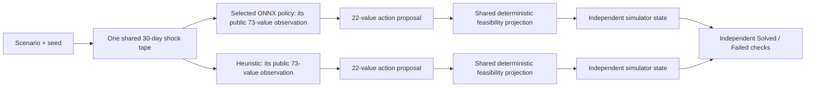

# Autonomous City Recovery Planner

Autonomous City Recovery Planner is a local, synthetic-disaster research demo. It compares an explicitly selected ONNX policy with a transparent public-state heuristic inside the same 30-day city-recovery simulator, then exposes both independent outcomes and both complete daily trajectories in a technical Analyst Toolbox and a 3D city view.

The shortest accurate explanation is:

> Both planners start from the same public scenario and encounter the same realized disaster sequence. Each then observes its own evolving city through the same 73-field public schema and independently proposes how to use material, crews, depot stock, and preparedness investment. A shared feasibility layer makes each proposal physically valid, the simulator advances one day, and an identical six-part rule decides whether each planner solved that disaster.

This is a sequential planning system, not a classifier. Do not describe it with a generic “accuracy” percentage. The current model evidence is development-only: the primary benchmark is the number of synthetic disasters each planner independently **Solved** on the same 40 development tapes.

## See the system

| Live 3D recovery city | Paired recovery trajectory |
| --- | --- |
|  |  |
| Dispatch manifest | Decision log |
|  |  |

| Decision support |
| --- |
|  |

These interface captures use the legacy regression fixture selected explicitly for a local demonstration. The 35/40 v4 development result below is receipt-backed evidence, not the policy shown in the screenshots.

## Runtime and evidence truth first

The consolidated runtime has one policy-selection rule: the operator must provide the ONNX artifact to serve. `scripts/setup.ps1` installs the runtime and builds the frontend without choosing a model. `scripts/run.ps1` accepts `-PolicyPath` or `INNOVERSE_POLICY_PATH`, then preflight validates the artifact's `73 → 22` tensor contract, bounded inference, and a complete smoke comparison before starting FastAPI.

There is no implicit production checkpoint, fallback model, manifest, or source-seal lookup. `tests/fixtures/legacy_policy.onnx` exists only as a regression and evaluation fixture. The measured 1M-transition v4 policy is represented by development evidence; its diagnostic checkpoint was not persisted and is not a deployable artifact in this repository.

### Current development benchmark

All methods below ran on the same 40 development tapes. The consolidated v4 path has not used the final split. Its score is therefore framed against the measured **37-case achievable ceiling**, not an assumed ceiling of 40: v4 PPO reaches **35 / 37 of the measured ceiling**.

| Development method | Solved on 40 development tapes | Position against the measured ceiling |
| --- | --- | --- |
| **v4 PPO at 1M active transitions** | **35 / 40**, 95% Wilson interval **[0.739, 0.945]** | **35 / 37** |
| Tuned constant rule | **33 / 40** | 33 / 37 |
| BC initialization | **32 / 40** | 32 / 37 |
| BC teacher | **31 / 40** | 31 / 37 |
| Legacy shipped-policy regression fixture | **31 / 40** | 31 / 37 |
| Reactive heuristic | **17 / 40** | 17 / 37 |
| Causal MPC, horizon `k=1` | **18 / 40** | 18 / 37 |
| Causal MPC, horizon `k=3` | **29 / 40** | 29 / 37 |
| Causal MPC, horizon `k=5` | **30 / 40** | 30 / 37 |
| Privileged clairvoyant oracle | **37 / 40** | Measured ceiling; future-shock access, **not a submission baseline** |

The canonical aggregate and paired comparisons are in `benchmarks/v4/development-baselines.md`; complete ordered rows and source hashes are in `internal/developmental_runs/v4/step6-dev-baseline-table.json`. Both identify themselves as nonauthorizing development evidence with `final_split_used: false`.

The retired release's one-shot final report is retained at `docs/evidence/legacy-final-40.json` as legacy evidence only. It does not select a model, participate in current readiness, or describe the v4 development policy.

## Quick start on a fresh Windows computer

### Requirements

- 64-bit Windows 10 or Windows 11
- PowerShell
- Python **3.12**
- Node.js LTS with npm: **20.19+**, **22.12+**, or a newer even-numbered LTS release (for example, Node 24)
- an internet connection for first-time dependency installation
- a current Chrome, Edge, or Firefox browser

The runtime uses ONNX Runtime on CPU. A GPU, CUDA, Git, and `uv` are not required.

### 1. Open PowerShell in the package root

The package root is the folder containing this README, `requirements.txt`, `backend`, `frontend`, `model`, and `scripts`.

### 2. Install the runtime and browser

```powershell
powershell -ExecutionPolicy Bypass -File .\scripts\setup.ps1
```

Setup performs these steps:

1. finds 64-bit Python 3.12 and a supported Node.js LTS release (20.19+, 22.12+, or a newer even-numbered LTS);
2. uses Windows Package Manager (`winget`) to install a missing Python or Node runtime when possible;
3. creates an isolated Python environment in `.venv`, or in a safe short `%LOCALAPPDATA%` path if the package path is too long for Windows;
4. installs the runtime packages from `requirements.txt`;
5. installs the locked browser packages with `npm ci`;
6. builds `frontend/dist`; and
7. if `INNOVERSE_POLICY_PATH` is already set, runs preflight against that policy.

Setup succeeds without a selected policy. In that case it prints that the runtime is installed and model selection is still required. `frontend/dist` is generated from the React source and is the static browser runtime served by FastAPI; `setup.ps1` reproducibly creates it after `npm ci`.

To prevent setup from invoking `winget`, install Python 3.12 and Node yourself, then run:

```powershell
powershell -ExecutionPolicy Bypass -File .\scripts\setup.ps1 -SkipToolBootstrap
```

### 3. Select a policy and start the app

Point the launcher at the ONNX policy you intend to serve. Either set the environment variable:

```powershell
$env:INNOVERSE_POLICY_PATH = 'C:\path\to\selected-policy.onnx'
powershell -ExecutionPolicy Bypass -File .\scripts\run.ps1
```

Or pass the path directly:

```powershell
powershell -ExecutionPolicy Bypass -File .\scripts\run.ps1 `
    -PolicyPath 'C:\path\to\selected-policy.onnx'
```

Do not start `run.ps1` until setup has printed **`[setup] COMPLETE`**. The launcher resolves the selected file, runs preflight, starts FastAPI at `127.0.0.1:4117`, and opens:

```text
http://127.0.0.1:4117/#/toolbox
```

Keep the PowerShell window open. Press `Ctrl+C` there to stop the server.

Use another port if `4117` is occupied:

```powershell
powershell -ExecutionPolicy Bypass -File .\scripts\run.ps1 `
    -PolicyPath 'C:\path\to\selected-policy.onnx' `
    -Port 4120
```

Start without opening a browser:

```powershell
powershell -ExecutionPolicy Bypass -File .\scripts\run.ps1 `
    -PolicyPath 'C:\path\to\selected-policy.onnx' `
    -Port 4120 `
    -NoBrowser
```

### 4. Run a standalone runtime check

With `INNOVERSE_POLICY_PATH` set:

```powershell
powershell -ExecutionPolicy Bypass -File .\scripts\preflight.ps1
```

For an alternate port:

```powershell
powershell -ExecutionPolicy Bypass -File .\scripts\preflight.ps1 -Port 4120
```

Preflight checks required runtime files, Python 3.12, the frontend build, port availability, the ONNX Runtime CPU session, exact input `observation [batch,73]` and output `action [batch,22]` tensors, finite actions inside `[-1,1]`, and a deterministic 30-day smoke comparison with zero hard violations and exact conservation. Set `INNOVERSE_POLICY_SHA256` as well when the selected artifact must match a known digest.

## The four different pieces

The project is easier to understand when the learned policy, baseline, simulator, and feasibility layer are kept separate.



| Piece | What it does | What it does not do |
| --- | --- | --- |
| **Selected ONNX policy** | A learned policy maps the current 73-value public observation to a 22-value daily intervention proposal. | It does not see future shocks, alter simulator rules, or bypass constraints. |
| **Public heuristic** | A fixed, transparent formula reacts to service gaps, priorities, stock, throughput, pending deliveries, preparedness, and public risk. | It is not trained, does not inspect PPO actions, and does not see future shocks. |
| **CityRecoveryEnv** | The authored synthetic world generates shocks and advances services, depots, deliveries, roads, crews, repair, and preparedness. | It is not a learned model and does not choose actions for either planner. |
| **Feasibility projector** | Deterministically converts either planner's proposal into allocations that satisfy daily bounds and conservation rules. | It is not another planner and does not choose a high-scoring strategy for the policy. |

The candidate and heuristic run in separate copies of the same environment but receive an identical shock schedule. This prevents one planner from winning because it encountered an easier random disaster.

## What one simulation represents

Every case lasts exactly **30 days** and contains five service systems in this fixed order:

1. transport;
2. housing;
3. food;
4. healthcare; and
5. public services.

The case defines initial service levels, public priorities, a daily material budget, a daily crew pool, five recovery targets, hazard probability and severity bounds, and optional forced shocks. The supported hazards are aftershock, supply disruption, epidemic, utility failure, and weather.

The simulator accounts for:

- current service level and cross-service dependencies;
- material allocations and a separate non-carrying daily crew pool;
- depot stock, depot capacity, same-day delivery, pending next-day arrivals, and stock release;
- road capacity, throughput loss, depot damage, mutual aid, and food spoilage;
- repair floors, service-specific crew productivity, explicit unused material, and explicit idle crews;
- preparedness work that consumes both material and crews, decays between days, reduces shock impact, and is partly consumed when a shock occurs; and
- exact per-day logistics and conservation evidence.

Days **28–30** form the frozen three-day assessment tail. Forced shocks are rejected during those days so the final condition measures sustained recovery after the intervention period. Random shocks also respect the simulator's frozen tail semantics.

Given the same full scenario, seed, policy artifact, baseline version, and source identity, the comparison is deterministic.

## Why this problem is hard

On the development tapes, a 30-day run contains a mean of **10.6 shocks**, with a range of **4 to 16**. The final shock lands on days 25–27 in **32 of 40 cases (80%)**, and on day 27 exactly in **13 of 40**. Shocks are blocked during the days 28–30 assessment window.

Service recovery is concave and slow, so a late shock cannot be repaired reactively. The viable strategy is to buy resilience in advance against hazards visible only as probabilities. The measured consequence is that the learned policy's mean minimum tail margin grows **0.0288 → 0.0329 → 0.0397 → 0.0497** across BC, 200k, 500k, and 1M transitions: it learns to hold a buffer.

## Policy runtime and training architecture

| Property | Current contract |
| --- | --- |
| Runtime artifact | One explicitly selected ONNX file |
| Observation | `observation: tensor(float)[batch,73]` |
| Action | `action: tensor(float)[batch,22]`, finite and inside `[-1,1]` |
| Observation normalization | Must be embedded in the selected ONNX artifact; the runtime does not apply Python-side normalization |
| Runtime provider | ONNX Runtime `CPUExecutionProvider` |
| Runtime execution | Sequential, one intra-op thread and one inter-op thread |
| Training algorithm | Stable-Baselines3 Proximal Policy Optimization (PPO) |
| Training actor | `73 → 384 → 256 → 128 → 22` |
| Training critic | `73 → 384 → 256 → 128 → 1` |
| Hidden activation / initialization | SiLU / orthogonal |
| Training-time log standard deviation | 22 trainable values initialized at `-1.5` |

`model/policy.py` validates the public tensor names, shapes, types, provider, smoke inference, and action bounds. It deliberately does not require a particular hidden-layer graph or infer training provenance from the ONNX file. The architecture below the tensor boundary describes `scripts/train_policy.py`; the repository does not currently contain a deployable checkpoint from the measured 1M-transition v4 run.

## The exact 73 public inputs

Whenever a row contains five values, it uses the fixed service order `transport, housing, food, healthcare, public_services`.

| Index | Field or ordered group | Meaning |
| --- | --- | --- |
| 1–5 | `service_{service}` | Current normalized service level. |
| 6–10 | `priority_{service}` | Public scenario priority for each service. |
| 11–15 | `support_{service}` | Current dependency/support factor. |
| 16–20 | `shock_impact_{service}` | Current day's observed hazard impact. |
| 21–25 | `depot_stock_fraction_{service}` | Available depot stock relative to capacity. |
| 26–30 | `pending_arrival_pressure_{service}` | Public pressure from material already in transit. |
| 31–35 | `throughput_factor_{service}` | Current usable logistics throughput. |
| 36–40 | `depot_damage_penalty_{service}` | Current depot damage penalty. |
| 41–45 | `depot_damage_days_fraction_{service}` | Normalized remaining damage duration. |
| 46–50 | `recovery_target_{service}` | Public target the service must sustain in the assessment tail. |
| 51–55 | `prior_day_critical_streak_fraction_{service}` | Normalized length of the observed critical-service streak. |
| 56–60 | `preparedness_level_{service}` | Current stored preparedness. |
| 61 | `available_material_budget_fraction` | Today's normalized material budget. |
| 62 | `available_crew_pool_fraction` | Today's normalized crew pool. |
| 63 | `horizon_remaining_fraction` | Fraction of the 30-day horizon remaining. |
| 64 | `assessment_tail_active` | Whether the three-day assessment tail is active. |
| 65 | `current_shock_severity` | Observed severity of today's shock. |
| 66 | `road_capacity` | Current public road/logistics capacity. |
| 67 | `days_since_last_shock_fraction` | Normalized time since the latest shock. |
| 68 | `previous_weighted_resilience` | Previous day's priority-weighted resilience. |
| 69–73 | `public_next_day_risk_{aftershock,supply,epidemic,utility,weather}` | Causal public hazard-risk indicators, in the listed hazard order. |

The five public-risk values affect hazard odds but do not reveal the next random draw or future shock tape. Both planners receive the same indicators.

## The exact 22 action outputs

Again, every five-value group follows the fixed service order.

| Index | Field or ordered group | Meaning |
| --- | --- | --- |
| 1–5 | `material_share_{service}` | Relative preference for today's material allocation. |
| 6 | `material_utilization` | How much of the daily material budget the policy requests. |
| 7–11 | `crew_share_{service}` | Relative preference for today's crew allocation. |
| 12 | `crew_utilization` | How much of the daily crew pool the policy requests. |
| 13–17 | `stock_release_{service}` | Per-service gates controlling use of physically available depot stock. |
| 18–22 | `preparedness_investment_{service}` | Per-service gates that divide feasible work between preparedness and repair. |

Raw actor outputs are clipped to `[-1,1]`. Shares are decoded into positive proposal weights; utilization, release, and preparedness gates are mapped into `[0,1]`. These are proposals, not permission to violate physics.

## What the feasibility layer guarantees

The selected policy and heuristic use the same action decoder and constraint code.

For material and crews separately, the projector:

1. calculates public lower and upper bounds;
2. turns the planner's share preferences into a proposal;
3. applies deterministic capped-simplex projection;
4. respects the chosen utilization gate;
5. records projection distance and binding constraints; and
6. leaves any unused material or idle crews explicit.

Preparedness cannot consume the repair floors reserved for critically damaged services. Preparedness work is limited by both physical stock and crew capacity. Repair then consumes from the remaining stock-release budget. Every transition records depot opening stock, arrivals, preparedness consumption, repair dispatch, spoilage or loss, closing stock, pending arrivals, and a conservation residual.

The projector is a guardrail, not a hidden optimizer. A poor policy can remain feasible and still fail the disaster.

## How the development policy was trained

The current training flow in `scripts/train_policy.py` is linear and inspectable: **BC/DAgger → actor-frozen critic warm-up → PPO actor-critic updates → development evaluation → new receipt**. The tool learns only from training cases and does not import or evaluate the final split.

### Current optimizer contract

| Training setting | Current default |
| --- | --- |
| Active PPO budget | 8,000,000 actor-critic transitions |
| Policy seed | `37017` |
| Simulator lanes | 20 |
| Steps per lane / rollout | 250 / 5,000 transitions total |
| PPO batch size / epochs | 500 / 5 |
| Learning rate | `7.5e-5` |
| Discount / GAE | `0.99` / `0.95` |
| Clip range | `0.15` |
| Entropy / value coefficients | `0.003` / `0.5` |
| Target KL | `0.02`, with Stable-Baselines3 early stopping |
| Exploration | `log_std_init=-1.5`, `use_sde=False` |
| Observation handling | `VecNormalize`, with BC observation moments frozen during PPO by default |

The actor warm start uses four public-only DAgger iterations with beta schedule `[1,0,0,0]`, 15 epochs per iteration, batch size 512, and actor learning rate `0.001`. The teacher sees the same causal public observation contract as the learned policy and never receives the future tape.

Before PPO changes the actor, the trainer freezes every actor parameter and trains the critic alone for at least 50,000 and at most 100,000 transitions, stopping after the minimum once explained variance exceeds `0.5`. It records actor hashes, observation and return moments, explained variance, approximate KL, clip fraction, entropy loss, value loss, policy-gradient loss, and action standard deviation. Development curves are recorded at 200k, 500k, 1M, and the requested terminal budget.

The current 35/40 result comes from the nonauthorizing 1M-transition development receipt at `internal/developmental_runs/v4/step3e-matched-reward-1m-seed-37017-attempt-02.json`. That run persisted diagnostics and per-case outcomes, not a checkpoint or deployable ONNX file.

### Role-separated scenario splits

| Split | Families × seeds | Cases | Purpose |
| --- | --- | --- | --- |
| Training | 6 × 32 (`810000–810031`) | 192 | Behavior cloning, DAgger, critic warm-up, and PPO interaction. |
| Development | 5 × 8 (`820000–820007`) | 40 | Learning curves, policy comparison, and headroom measurement. |
| Final | 5 × 8 (`830000–830007`) | 40 | Reserved evaluation set; no v4 final result is present in this repository. |

The family sets and seed intervals are disjoint. The development evidence names its split, records that the final split was not used, and binds every result to ordered scenario rows and disaster-tape hashes.

## The public heuristic

The runtime baseline retains the stable identity `reactive-public-state-heuristic-v3` version `3.0.0`. Its implementation lives in `backend/app/city/planners.py`; it consumes the same 73-field public observation schema and emits the same 22-field action contract as the selected policy. After day one, each planner's numeric observation legitimately differs because its earlier actions produced a different service, stock, delivery, and preparedness state; the exogenous shock tape remains matched.

Its fixed rules prioritize target gaps and public priorities, adjust material and crew use using visible stock, pending deliveries, and throughput, release stock reactively, and invest a bounded amount in preparedness based on public risk. It has no learned weights, no access to PPO outputs, no future tape, and no result-dependent tuning during evaluation.

This heuristic is intentionally understandable, but “transparent” does not mean “fake.” It must independently satisfy the same Solved rule and all feasibility checks. The development evidence preserves cases where it solves the disaster and another planner does not.

## What “Solved” means

Each planner receives its own `absolute_outcome`. A planner is Solved only if **all six** frozen checks pass:

| Check | Frozen requirement |
| --- | --- |
| Assessment-tail targets | Every one of the five sectors is at or above its public target on every one of the final three days; the canonical development cases use `0.55`. |
| Resilience AUC | Mean priority-weighted daily resilience is at least `0.44`. |
| Critical service-days | At most 8% of 150 service-days may be below `0.30`: a maximum of **12**. |
| Hard constraints | Total hard-violation count is exactly `0`. |
| Material conservation | Maximum absolute logistics conservation residual is at most `1e-6`; the observed residual is exactly `0.0`. |
| Terminal pipeline | Terminal pending arrivals are at or below depot capacity. |

The frozen definition hash is `d033c42b43ade8fff3c3b2d11f92adcf7567b4221b3b16d798a8f0afc896df82`. The response includes each check, each service's tail result, reason codes for failure, the exact definition ID, and that definition hash. The browser does not create its own friendlier version of Solved.

The definition resists several simple ways to game a terminal score. The first check is a conjunction over sectors **and** days, so a strong sector cannot mask a weak one and a planner cannot pass by spiking only on the last day. The tail-target and resilience-AUC checks pull against each other: neither “steady but ends short” nor “neglect then sprint” passes. The terminal-pipeline check closes end-game inventory dumping.

The calibration is measured from both sides. The reactive baseline solves **14 / 40** on the retained legacy one-shot benchmark, while the privileged development oracle sees every future shock and still fails **3 of 40**. These are separate benchmark suites, but together they bound the authored bar empirically: it is neither trivially passable nor saturated by clairvoyance.

### Independent outcomes, not “winning against” the other planner

Every case belongs to exactly one pair:

- `both_solved`;
- `ppo_only`;
- `heuristic_only`; or
- `neither`.

Therefore:

```text
PPO solved count       = both_solved + ppo_only
Heuristic solved count = both_solved + heuristic_only
```

“PPO won 24 head-to-head comparisons” would not mean it solved 24 disasters. A planner can have a slightly higher AUC while both planners fail, or a lower AUC while both pass the threshold checks.

### Why resilience AUC is secondary

Resilience AUC is still useful: it summarizes the average quality of the 30-day service trajectory and can distinguish two plans with the same binary verdict. The report includes candidate wins, baseline wins, ties, both means, and their difference.

It remains secondary because it cannot replace the full terminal-target, critical-day, feasibility, and conservation definition. The primary claim is the independently measured number of disasters Solved.

## Worked example

Case `v3_dev_health_compound:820007` is the legacy model's narrowest win. It contains **14 shocks in 30 days**, with **209 material per day** and **153 crew per day**.

| Sector | Day 0 | Day 30 | Target |
| --- | ---: | ---: | ---: |
| Transport | 34.5% | 62.7% | 55% |
| Housing | 42.6% | 59.2% | 55% |
| Food | 26.3% | 64.5% | 55% |
| Healthcare | 23.6% | 71.0% | 55% |
| Public services | 23.6% | 66.1% | 55% |

It passes three checks by a hair simultaneously: housing tail margin **+0.75 percentage points**, resilience AUC **0.44171** against the `0.44` floor, and exactly **12 critical-service days** of the 12 allowed.

The final service levels land in near-exact priority order. Healthcare, with priority **1.88**, starts lowest at **23.6%** and finishes highest at **71.0%**; public services at priority **1.52** follows, then food at **1.32**. The only inversion is housing versus transport, whose priorities differ by **0.09**.

## Using the Analyst Toolbox

Open `http://127.0.0.1:4117/#/toolbox` after the launcher reports ready.

### 1. Configure a case

The scenario panel controls:

- a deterministic unsigned 32-bit seed;
- case name from 1 to 64 characters;
- daily material budget from 50 to 500;
- daily crew pool from 50 to 300;
- five initial service levels from 0.05 to 0.95;
- five public priorities from 0.5 to 2.0;
- five recovery targets from 0.45 to 0.75;
- shock probability from 0 to 0.35;
- minimum shock severity from 0.05 to 0.25;
- maximum shock severity from 0.10 to 0.40 and strictly above the minimum; and
- optional forced shocks with severity from 0.05 to 0.40 on days 1–27.

The horizon is always 30 days and the assessment tail is always three days. The frontend and backend both reject forced shocks on days 28–30.

### 2. Run the paired case

Select **Run paired 30-day trace**. The backend creates one shock schedule, runs the selected ONNX policy and the heuristic independently, checks both outcomes, saves the canonical result, and returns both trajectories.

The top verdict cards show **Solved** or **Failed** for each planner from the backend's official outcome. They do not infer a verdict from which line is higher.

### 3. Read the signature trace

The main visualization is the paired 30-day recovery trace. It overlays both resilience curves, shared hazards, and the shaded assessment tail. Select any day to inspect the same point in both trajectories.

### 4. Use the four evidence tabs

- **Trajectory** — service levels, shocks, recovery, and daily reward.
- **Daily audit** — before/after state, material and crew use, release, preparedness, hard violations, and official outcome evidence.
- **Dispatch manifest** — stock, deliveries, physical dispatch, repair, preparedness consumption, idle resources, and conservation.
- **Decision log** — raw 22-value action, feasibility projection, planner evidence, all 73 public inputs, local action sensitivity, one-day counterfactual replay, recovery-plan exports, and preparedness-versus-shock-absorption evidence.

Use the candidate/heuristic toggle in the day inspector to compare like-for-like fields. The architecture section reports the selected artifact identity and tensor contract returned by API metadata.

### 5. Recheck the runtime

The Toolbox's **Recheck runtime** action retries metadata. It cannot choose or repair a policy; it only reports whether the backend can now load the explicitly configured artifact.

The browser implementation contains zero uses of `any` or `@ts-ignore` across roughly 6,000 lines of TypeScript. Its accessibility surface includes **30 `aria-label` attributes**, **29 `role=` assignments**, an `aria-live` update region, and an `aria-modal` dialog.

## Using the 3D city view

Open `http://127.0.0.1:4117/#/game` or use the Toolbox navigation.

The 3D view is a presentation of the same backend comparison, not a second model or a separate scoring system. It visualizes city services, hazards, depots, vehicles, and the 30-day progression. Operator-triggered incidents are limited to the intervention window; the assessment tail remains protected. The debrief uses the same backend Solved/Failed outcomes as the Toolbox.

If the 3D scene is slow, reduce browser zoom, close GPU-heavy tabs, or use the Toolbox, which contains the complete numerical evidence.

## HTTP API

| Method and path | Purpose |
| --- | --- |
| `GET /health/live` | Process liveness, independent of policy selection. |
| `GET /health/ready` | Loads the explicitly selected policy and reports its identity and tensor contract; returns 503 when no valid policy is configured. |
| `GET /api/v1/meta` | Current policy, environment, exact orders, outcome definition, baseline, persistence, and determinism metadata. |
| `POST /api/v1/simulations/compare` | Runs and persists one selected-policy-versus-heuristic comparison on a shared tape. |
| `GET /api/v1/simulations?engine_version=city-recovery-env-v3` | Lists saved run summaries for the stable engine-version identifier. |
| `GET /api/v1/simulations/{result_id}` | Reads one canonical saved result. |
| `GET /api/v1/simulations/{result_id}/explanations` | Replays the persisted candidate and returns non-causal local action sensitivity for all 73 observation channels on each day. |
| `POST /api/v1/simulations/{result_id}/counterfactuals` | Overrides one day's material or crew shares and deterministically replays the selected policy thereafter without persisting a derived run. |
| `GET /api/v1/simulations/{result_id}/recovery-plan?planner=candidate&format=csv` | Downloads the persisted candidate or baseline trajectory as deterministic CSV or PDF. |

Example comparison request:

```powershell
$body = @{
    seed = 424242
    scenario = @{
        name = 'Technical demo'
        horizon_days = 30
        daily_budget = 180
        initial_services = @(0.34, 0.26, 0.41, 0.38, 0.30)
        priorities = @(1.0, 1.1, 1.2, 1.4, 1.0)
        shock_probability = 0.20
        severity_min = 0.10
        severity_max = 0.28
        forced_shock = @{ day = 5; type = 'utility'; severity = 0.26 }
        forced_shocks = @()
        daily_crew_pool = 150
        recovery_targets = @(0.55, 0.55, 0.55, 0.55, 0.55)
        assessment_tail_days = 3
    }
} | ConvertTo-Json -Depth 8

Invoke-RestMethod `
    -Method Post `
    -Uri 'http://127.0.0.1:4117/api/v1/simulations/compare' `
    -ContentType 'application/json' `
    -Body $body
```

The response uses schema `4.0.0`. It includes the shared shock schedule and hash, exact observation and action orders, policy and baseline identities, both planner summaries, both complete trajectories, both absolute outcomes, the secondary AUC difference, and a content-addressed `result_id`.

Saved runs default to:

```text
%LOCALAPPDATA%\Innoverse\ai17-city-recovery\runs
```

Use a separate location without changing code:

```powershell
$env:INNOVERSE_STATE_DIR = 'D:\InnoverseRuns'
$env:INNOVERSE_POLICY_PATH = 'C:\path\to\selected-policy.onnx'
powershell -ExecutionPolicy Bypass -File .\scripts\run.ps1
```

## Active folder and file map

Generated folders such as `.venv`, `.pytest_cache`, `.ruff_cache`, `frontend/node_modules`, `frontend/dist`, `__pycache__`, and TypeScript build-info files are reproducible build output. The active source tree is intentionally compact:

```text
.
├── backend/app/city/             Physics, scenarios, outcome, planners, optimizer, environment
├── backend/app/                  HTTP, schemas, persistence, evidence, analysis, exports
├── benchmarks/v4/                Development aggregate for the consolidated path
├── docs/                         Guided code tour, screenshots, and legacy evidence
├── frontend/                     React Analyst Toolbox and 3D city
├── internal/developmental_runs/  Nonauthorizing development receipts
├── model/                        Explicit ONNX runtime boundary
├── scripts/                      Setup, launch, training, evaluation, headroom, contract generation
└── tests/                        Python executable specifications and regression fixture
```

For a guided reading order rather than a flat inventory, start with `docs/CODE_TOUR.md`.

### `backend/app/city`

| Path | Role |
| --- | --- |
| `physics.py` | Canonical service/hazard order, allocation math, logistics constants, shock mechanics, and conservation measurements. |
| `scenarios.py` | Training, development, and reserved final families plus deterministic tape generation. |
| `outcome.py` | The six-check absolute outcome and trajectory summaries. |
| `planners.py` | Reactive heuristic, preparedness teacher, tuned rule, and shared weight-to-logit conversion. |
| `optimizer.py` | OR-Tools allocation proposals used by headroom analysis. |
| `environment.py` | The 73/22 environment, feasibility projection, transitions, rollout, and comparison composition. |

### `backend/app`

| Path | Role |
| --- | --- |
| `main.py` | FastAPI composition root, policy loading, comparison, analysis, export, health, metadata, and static frontend routes. |
| `models.py` | Strict public scenario and comparison request schemas. |
| `persistence.py` | Canonical content-addressed local result storage. |
| `shared_evidence.py` | Canonical JSON, hashing, Wilson intervals, split contracts, and durable writes. |
| `recovery_analysis.py` | Replay-verified local sensitivity and one-day allocation counterfactuals. |
| `recovery_exports.py` | Deterministic CSV and PDF recovery plans. |

### `model`

| Path | Role |
| --- | --- |
| `policy.py` | Loads one explicit ONNX artifact, validates its SHA-256 when supplied, enforces the 73/22 contract, and runs CPU inference. |
| `__init__.py` | Public policy exports. |

### `frontend`

| Path | Role |
| --- | --- |
| `package.json`, `package-lock.json` | Locked React/Vite/TypeScript dependency and command definitions. |
| `index.html`, `vite.config.ts`, `tsconfig*.json` | Browser entry and build configuration. |
| `src/main.tsx` | React browser bootstrap. |
| `src/App.tsx` | Main Toolbox and routing shell. |
| `src/api.ts`, `src/types.ts` | Strict runtime client, response validation, and public types. |
| `src/analysisApi.ts`, `src/DecisionAnalysis.tsx` | Explanation, counterfactual, export, and sustainability decision support. |
| `src/scenarios.ts` | Browser scenario presets and validation helpers. |
| `src/viewModel.ts` | Derived presentation values that preserve backend verdicts. |
| `src/shockPresentation.ts` | Shared hazard labels and presentation helpers. |
| `src/generated/backendContract.ts` | Generated cross-language service, hazard, tensor, request, and outcome contract. |
| `src/styles.css` | Municipal workbench visual system and responsive layout. |
| `src/game/` | 3D city, infrastructure, hazards, vehicles, quality adaptation, audio, pacing, session, and outcome debrief. |

### `scripts`

| Path | Role |
| --- | --- |
| `setup.ps1` | Fresh Windows dependency installation and frontend build, with optional configured-policy preflight. |
| `run.ps1` | Explicit-policy preflight, local FastAPI launch, and browser opener. |
| `preflight.ps1`, `preflight_check.py` | Runtime file, ONNX contract, inference, and smoke-comparison checks. |
| `project_environment.ps1` | Resolves the package's Python 3.12 environment, including the long-path fallback. |
| `train_policy.py` | BC/DAgger, actor-frozen critic warm-up, PPO, development milestones, diagnostics, and receipt writing. |
| `evaluate.py` | Shared-tape comparisons for named public planners or explicit ONNX paths. |
| `headroom.py` | Development-only causal MPC and privileged-oracle headroom analysis. |
| `generate_frontend_contract.py` | Generates or checks the canonical Python-to-TypeScript contract. |

### Evidence and tests

| Path | Role |
| --- | --- |
| `benchmarks/v4/development-baselines.md` | Human-readable 40-tape development aggregate and paired comparisons. |
| `internal/developmental_runs/v4/step6-dev-baseline-table.json` | Complete development rows, source hashes, invariants, and paired statistics. |
| `internal/developmental_runs/v4/step3e-matched-reward-1m-seed-37017-attempt-02.json` | Matched 1M-transition training and reward-comparison evidence. |
| `docs/evidence/legacy-final-40.json` | Historical final report for the retired release; not an active runtime dependency. |
| `tests/fixtures/legacy_policy.onnx` | Legacy ONNX regression/evaluation fixture; not an implicitly selected runtime model. |
| `tests/test_city_*.py`, `tests/test_simulator*.py` | Physics, scenarios, outcome, planners, optimizer, and environment behavior. |
| `tests/test_policy.py`, `tests/test_api.py`, `tests/test_recovery_*.py` | Explicit policy loading, HTTP, replay analysis, and export behavior. |
| `tests/test_train_policy.py`, `tests/test_evaluate.py`, `tests/test_headroom.py`, `tests/test_development_evidence.py` | Scientific tools and development evidence. |
| `frontend/src/*.test.ts`, `frontend/src/generated/*.test.ts` | API parsing, generated contract, view-model, and decision-support behavior. |

## Policy selection and readiness

Readiness is about the explicitly selected runtime artifact, not the development-score receipts. `GET /health/live` confirms only that FastAPI is alive. `GET /health/ready` loads the configured policy and returns 503 until that succeeds.

The runtime requires:

1. a readable path in `INNOVERSE_POLICY_PATH` or `run.ps1 -PolicyPath`;
2. a loadable ONNX graph with exactly one `observation` float input shaped `[batch,73]`;
3. exactly one `action` float output shaped `[batch,22]`;
4. finite output inside `[-1,1]` for smoke inference;
5. the Python runtime modules and built `frontend/dist`; and
6. a successful deterministic smoke comparison.

An optional expected digest makes model selection content-specific:

```powershell
$env:INNOVERSE_POLICY_PATH = 'C:\path\to\selected-policy.onnx'
$env:INNOVERSE_POLICY_SHA256 = (Get-FileHash `
    $env:INNOVERSE_POLICY_PATH `
    -Algorithm SHA256).Hash.ToLowerInvariant()
powershell -ExecutionPolicy Bypass -File .\scripts\preflight.ps1
```

The ready and metadata endpoints report the selected artifact's SHA-256, path stem, runtime, observation/action counts, and canonical orders. Changing `INNOVERSE_POLICY_PATH` changes the served candidate; no repository fixture or development receipt silently replaces it.

## Developer verification

The launcher needs only `requirements.txt`. Tests for the training tool additionally import Stable-Baselines3 and PyTorch. After running setup, resolve the actual Python environment, including the automatic short-path fallback, and install the same development packages used by CI:

Resolve the correct environment robustly, including long Windows paths:

```powershell
. .\scripts\project_environment.ps1
$ctx = Get-CityRecoveryEnvironmentContext -Root (Get-Location).Path
& $ctx.PythonPath -m pip install `
    httpx==0.28.1 `
    pytest==8.4.1 `
    ruff==0.12.4 `
    stable-baselines3==2.7.0 `
    torch==2.8.0
```

Run the active Python tests and lint:

```powershell
& $ctx.PythonPath -m pytest -q tests
& $ctx.PythonPath -m ruff check backend model scripts tests
```

The active tests cover physics, scenarios, outcome, environment, planners, optimizer, policy loading, API, persistence, decision support, exports, training, evaluation, headroom, and development evidence.

Run frontend tests, type checking, and production build:

```powershell
npm ci --prefix frontend
npm test --prefix frontend
npm run typecheck --prefix frontend
npm run build --prefix frontend
```

Check that the generated browser contract still matches canonical Python values:

```powershell
& $ctx.PythonPath .\scripts\generate_frontend_contract.py --check
```

Run runtime preflight separately when a selected ONNX file is available:

```powershell
$env:INNOVERSE_POLICY_PATH = 'C:\path\to\selected-policy.onnx'
powershell -ExecutionPolicy Bypass -File .\scripts\preflight.ps1
```

`.github/workflows/ci.yml` runs Ruff and the full Python suite, plus frontend tests, type checking, and production build, on every push and pull request.

## Maintainer-only development tools

Normal demo users do not need these commands. They run training or development analysis and may take substantial CPU time. Every output path shown below must be new; the tools refuse to overwrite an existing receipt.

```powershell
# BC/DAgger -> critic warm-up -> PPO -> development curve -> receipt
& $ctx.PythonPath .\scripts\train_policy.py `
    --json-output .\internal\developmental_runs\v4\new-training-receipt.json

# Shared-tape development comparison
& $ctx.PythonPath .\scripts\evaluate.py `
    --split dev `
    --policy tuned `
    --policy 'onnx:C:\path\to\selected-policy.onnx'

# Privileged development headroom analysis
& $ctx.PythonPath .\scripts\headroom.py `
    --developmental-nonauthorizing `
    --output .\internal\developmental_runs\v4\new-headroom-receipt.json
```

`scripts/evaluate.py` also contains the reserved final split, but no current README workflow invokes it. The v4 development result has no selected ONNX publication step in this repository; model export and selection must be completed explicitly before a trained policy can be passed to `run.ps1`. The blocking post-training sequence is specified in `docs/TRAINING_DEPLOYMENT_PLAN.md` and is not authorized by this documentation phase.

## Development evidence and provenance

The current performance claim is assembled from retained development evidence rather than runtime model selection:

1. `internal/developmental_runs/v4/step3e-matched-reward-1m-seed-37017-attempt-02.json` records matched initialization, optimizer settings, critic warm-up, 200k/500k/1M curves, per-case outcomes, diagnostics, and exact physics invariants.
2. `internal/developmental_runs/v4/headroom-probe-v4-dev.json` records tuned-rule, causal-MPC, and privileged-oracle headroom on the same 40 development cases.
3. `internal/developmental_runs/v4/step6-dev-baseline-table.json` assembles ten planners in one ordered table with Wilson intervals, paired exact McNemar comparisons, source hashes, and `final_split_used: false`.
4. `benchmarks/v4/development-baselines.md` is the human-readable aggregate whose SHA-256 is bound inside the Step 6 receipt.
5. `tests/test_development_evidence.py` verifies every reported solved count, paired outcome, oracle label, and Markdown binding.
6. `tests/test_consolidation_gate.py` anchors the consolidated outcome and engine hashes plus a complete deterministic golden trajectory.

These files support the development comparison but do not configure FastAPI. Runtime identity comes from the ONNX file explicitly supplied by the operator, and the API binds persisted results to that artifact's SHA-256. The legacy final JSON and legacy ONNX fixture remain separate historical/regression inputs under `docs/evidence` and `tests/fixtures`.

## Troubleshooting

### `setup.ps1` says Python or Node is missing

Run setup without `-SkipToolBootstrap` so it can use `winget`, or install 64-bit Python 3.12 and a supported Node.js LTS release manually. Setup refreshes discovery and accepts a verified installation even when `winget` reports that the package is already installed, so opening a new shell should not be necessary. If an external installer is still open, let it finish and rerun the same setup command.

Check versions:

```powershell
py -3.12 --version
node --version
npm --version
```

### PowerShell blocks a script

Use the documented form, which applies the policy only to that process:

```powershell
powershell -ExecutionPolicy Bypass -File .\scripts\setup.ps1
```

### `run.ps1` or `/health/ready` reports `DEPENDENCY_NOT_READY`

Confirm that `INNOVERSE_POLICY_PATH` is set in the shell that starts the app, or pass `-PolicyPath` directly. The selected file must be readable ONNX with the exact `observation [batch,73]` and `action [batch,22]` float contracts. If `INNOVERSE_POLICY_SHA256` is set, it must match the file exactly. Run `scripts/preflight.ps1` to see the contract or smoke-comparison failure before starting the server.

### Port 4117 is already in use

```powershell
powershell -ExecutionPolicy Bypass -File .\scripts\run.ps1 `
    -PolicyPath 'C:\path\to\selected-policy.onnx' `
    -Port 4120
```

Use the same port in the browser and preflight.

### The project path is very long

The setup scripts automatically place the Python environment under `%LOCALAPPDATA%\Innoverse\city-recovery\py312-<root-hash>` when the repository path would exceed the native-library path budget. Use `project_environment.ps1` rather than assuming `.venv\Scripts\python.exe` exists.

### The frontend looks stale or is blank

Stop the server, rebuild, and restart:

```powershell
npm ci --prefix frontend
npm run build --prefix frontend
powershell -ExecutionPolicy Bypass -File .\scripts\run.ps1 `
    -PolicyPath 'C:\path\to\selected-policy.onnx'
```

Then hard-refresh the browser with `Ctrl+F5`. Inspect `/health/live` and `/health/ready` separately: liveness can pass while policy loading correctly fails.

### A forced shock is rejected

Forced shocks are accepted only on days 1–27. Days 28–30 are the fixed assessment tail.

### Saved runs are not where expected

The default is `%LOCALAPPDATA%\Innoverse\ai17-city-recovery\runs`. Check whether `INNOVERSE_STATE_DIR` is set in the same PowerShell session that launched the app.

### The 3D view is slow but the Toolbox is responsive

The 3D route loads a much larger rendering bundle. Close other graphics-heavy tabs, update the browser, or use `#/toolbox`; all model evidence is available there without the 3D scene.

## How to present the project accurately

A concise presentation can say:

> We built a sequential planner for a five-service synthetic city-recovery environment. A candidate receives 73 causal public-state inputs and proposes 22 continuous controls for material, crews, depot release, and preparedness; a deterministic feasibility layer applies the same physical rules to it and a transparent public heuristic. On 40 development tapes, the measured 1M-transition v4 PPO policy solved 35 cases with 95% Wilson interval [0.739, 0.945], against a measured clairvoyant ceiling of 37, with zero hard violations and exact conservation. The development run did not persist a deployable checkpoint, so the consolidated runtime serves only an ONNX artifact explicitly selected by the operator.

## Data character

All scenarios and shock tapes are authored and generated locally by `backend/app/city/scenarios.py`; the repository does not bundle an empirical disaster dataset. Runtime metadata reports the selected policy identity, environment specification, baseline identity, and solved-definition hash.

---

For a demo operator: run `setup.ps1`, select a compatible ONNX file, and pass it to `run.ps1`. For a reviewer: start with `docs/CODE_TOUR.md`, `benchmarks/v4/development-baselines.md`, `internal/developmental_runs/v4/step6-dev-baseline-table.json`, `model/policy.py`, and `scripts/preflight_check.py`.
