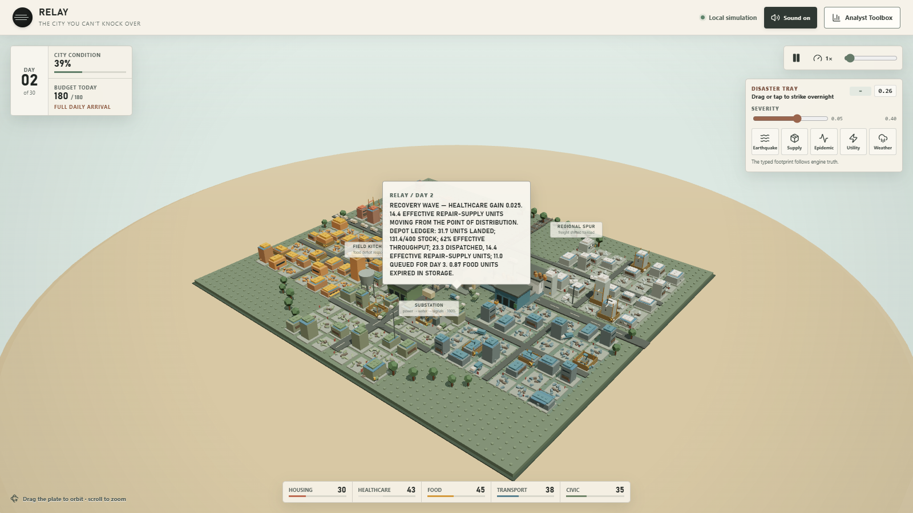
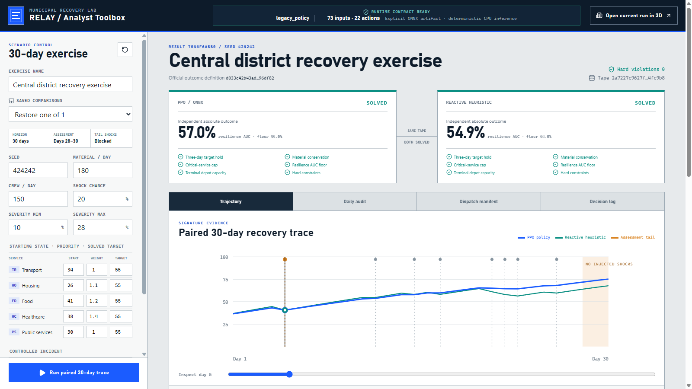
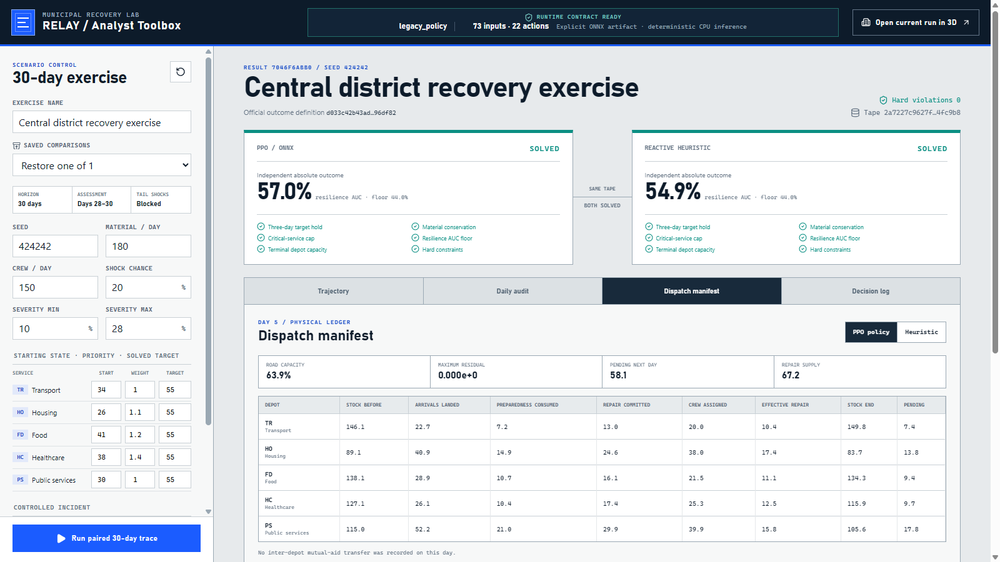
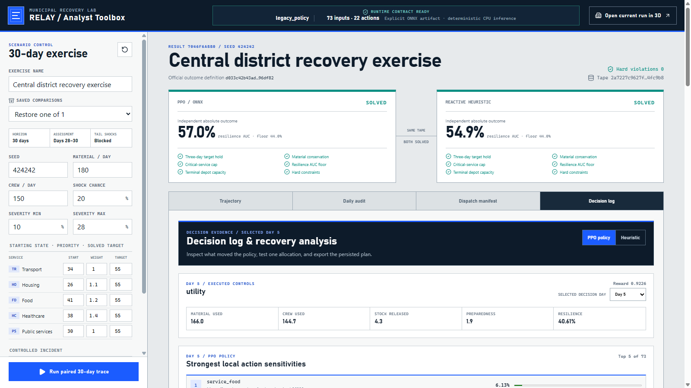
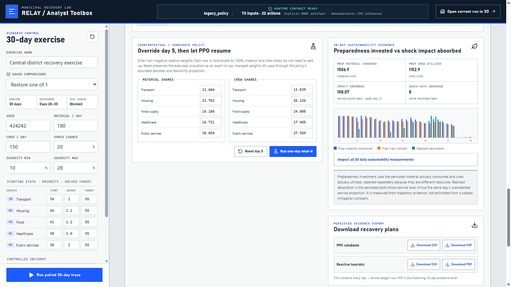
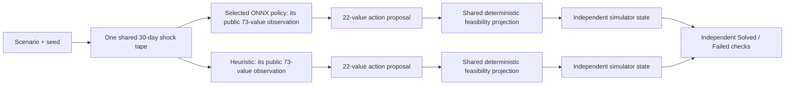

# Autonomous City Recovery Planner

Autonomous City Recovery Planner is a local, synthetic-disaster research demo. It compares the bundled, parity-approved v4 ONNX policy—or an explicit operator override—with a transparent public-state heuristic inside the same 30-day city-recovery simulator, then exposes both independent outcomes and both complete daily trajectories in a technical Analyst Toolbox and a 3D city view.

The shortest accurate explanation is:

> Both planners start from the same public scenario and encounter the same realized disaster sequence. Each then observes its own evolving city through the same 73-field public schema and independently proposes how to use material, crews, depot stock, and preparedness investment. A shared feasibility layer makes each proposal physically valid, the simulator advances one day, and an identical six-part rule decides whether each planner solved that disaster.

This is a sequential planning system, not a classifier. Do not describe it with a generic “accuracy” percentage. The primary measure is the number of synthetic disasters each planner independently **Solved**: development evidence supports reproducibility and checkpoint selection, while one separately authorized held-out evaluation records the frozen shipped artifact's final result.

## See the system

| Live 3D recovery city | Paired recovery trajectory |
| --- | --- |
|  |  |
| Dispatch manifest | Decision log |
|  |  |

| Decision support |
| --- |
|  |

These interface captures use the legacy regression fixture selected explicitly for a local demonstration. The v4 policy's **178 / 200 development-selection result**, **163 / 200 owner-authorized final result**, and historical 35/40 learned-policy result below are receipt-backed evidence, not the policy shown in the screenshots.

## Runtime and evidence truth first

The repository ships `artifacts/city_recovery_ppo.v4.onnx` as its zero-configuration policy. `scripts/setup.ps1` builds the runtime and preflights that artifact; `scripts/run.ps1` serves it by default. A nonblank `INNOVERSE_POLICY_PATH` overrides the bundle, and an explicit `-PolicyPath` overrides both. The selected path must resolve and pass the `73 → 22` tensor contract, bounded inference, and complete smoke comparison; an invalid higher-priority choice fails closed instead of falling back.

The bundled artifact is SHA-256 `a9f5e9b41be57d7cd34623725a5ab4067aa75fbab16dc666cecc3c0a06c26483`. Its neighboring manifest is descriptive provenance, not a second loader or authorization mechanism. `tests/fixtures/legacy_policy.onnx` remains only a regression and evaluation fixture and is never a runtime fallback.

### Current development benchmark and matched headroom diagnostic

The current comparison covers the expanded roster of 200 development tapes: five unchanged scenario families crossed with 40 seeds. **Demonstrated-achievable reference denominator = the 187 of 200 development cases solved by the privileged future-aware CEM run; its 13 search failures are not proofs of infeasibility.** At the registered 2M endpoint, the five policy seeds (`37017`, `47017`, `57017`, `67017`, and `77017`) solved **172, 171, 171, 174, and 169** cases: mean **171.4 / 200**, or **171.4 / 187 = 91.7%** of that achieved-count reference, with population standard deviation **1.62** and sample standard deviation **1.82**. No Wilson interval is reported for the optimizer-seed mean. The population value describes the complete registered five-seed sweep; the sample value describes dispersion when those seeds are treated as a sample of optimizer randomness. Selection then ranked all 20 complete milestone checkpoints and chose seed `67017` at 1M active actor-critic transitions with **178 / 200**, or **178 / 187 = 95.2%** of the achieved-count reference (descriptive post-hoc Wilson 95% **[0.9111, 0.9745]**), four solves ahead of the **174 / 200** runner-up. Full SB3-to-ONNX parity reproduced all 178 development solves, with zero hard violations, exact conservation, and no deterministic replay mismatches.

| Development method | Raw solved / 200 | Achieved-count ratio (/187 reference) | Descriptive Wilson 95% CI on /187 |
| --- | ---: | ---: | ---: |
| **Selected v4 PPO, seed 67017 at 1M** | **178 / 200** | **178 / 187 = 95.2%** | **[0.9111, 0.9745]** |
| Privileged clairvoyant CEM — anytime achieved lower bound | **187 / 200** | **187 / 187 = 100.0%** | **[0.9799, 1.0000]** |
| Reactive heuristic | **91 / 200** | **91 / 187 = 48.7%** | **[0.4160, 0.5578]** |
| Preparedness teacher | **151 / 200** | **151 / 187 = 80.7%** | **[0.7450, 0.8576]** |
| **Tuned constant rule** | **160 / 200** | **160 / 187 = 85.6%** | **[0.7981, 0.8988]** |
| Selected causal MPC, `k=5` | **153 / 200** | **153 / 187 = 81.8%** | **[0.7567, 0.8669]** |
| Legacy ONNX regression fixture | **141 / 200** | **141 / 187 = 75.4%** | **[0.6876, 0.8102]** |

The fixed CEM diagnostic ran on the identical 200 development tapes and sees the complete future shock tape. Against the shipped v4 policy, the matched partition is **177 both solved, 10 oracle-only, 1 policy-only, and 12 neither**; the two methods jointly demonstrate solutions on **188 / 200** cases. The **10 oracle-only cases are the remaining provable headroom** for the shipped policy. The policy's aggregate solved count is **178 / 187 = 95.2%** of the oracle's achieved count, while its case-matched coverage is **177 / 187 = 94.7%** of the oracle-solved cases. Those percentages are deliberately distinguished because the one policy-only case makes the solved sets non-nested.

The oracle is privileged, not a causal submission baseline or a model-selection input. CEM is an anytime search, so **187 / 200 is an achieved lower bound**, not a mathematical optimum, an infeasibility certificate, or a proven ceiling. Every planner in the current development table has zero hard violations and exactly `0.0` maximum conservation residual.

The five-seed study and matched ablations are summarized in `benchmarks/v4/training-study-200.md`, with a digest-bound index at `internal/developmental_runs/v4/training-study-200-summary.json`. The receipt-bound cheap-planner snapshot is in `benchmarks/v4/development-baselines-200.md`, with complete ordered rows in `internal/developmental_runs/v4/development-baselines-200.json`; it is preserved byte-for-byte from before the matched oracle rerun, so its historical-only oracle note records the evidence state at publication. The selected checkpoint is recorded in `internal/developmental_runs/v4/checkpoint-selection-200.json`; `internal/developmental_runs/v4/city_recovery_ppo.v4.parity.json` binds its SB3 and ONNX development rows, and `artifacts/city_recovery_ppo.v4.manifest.json` binds the published artifact to both receipts. These training, selection, and parity results remain development-only; the single final evaluation is separate and did not feed back into them.

A later development-only oracle-distillation study tested a fixed offline actor learned from privileged CEM trajectories, followed by the adopted critic warm-up and PPO configuration. Its three 2M endpoints solved **178, 174, and 170 / 200** cases: mean **174.0**, population standard deviation **3.27**, and sample standard deviation **4.0**. That mean is 2.6 cases above the original five-seed endpoint mean, but the best registered checkpoint only tied the shipped checkpoint at **178 / 200** and missed the preregistered **183 / 200** best-checkpoint threshold. The conjunctive gate therefore did not promote it. This null applies only to the fixed single-pass offline oracle-BC actor, adopted optimizer, and 2M budget; distribution shift remains unresolved. The complete portable result is in [the oracle-distilled PPO report](benchmarks/v4/oracle-distilled-ppo-study-200.md) and [machine receipt](internal/developmental_runs/v4/oracle-distilled-ppo-study-200.json). No final case was used, and the shipped artifact remains unchanged.

A separate development-only capacity study enlarged both actor and critic from `[384, 256, 128]` to `[768, 512, 256]` while preserving the public `73 -> 22` interface. At `3e-5`, its three 2M endpoints were **178, 176, and 175 / 200**: mean **176.33**, population SD **1.25**, and sample SD **1.53**. That is **+4.93 cases** against the incumbent five-seed endpoint mean; same-seed endpoint gains were **+6, +5, and +4**. The best still tied the shipped checkpoint at 178 and missed the preregistered 183 threshold, so the conjunctive gate did not promote it. All three low-LR curves continued upward from 1M to 2M (**+5, +3, +1**), making this a positive but non-promoting signal for the large-plus-low-LR combination—not a capacity-only conclusion or evidence of convergence. The smaller `3e-5` control was not run, so capacity and learning rate remain confounded. See the [network-capacity report](benchmarks/v4/network-capacity-study-200.md) and [portable machine receipt](internal/developmental_runs/v4/network-capacity-study-200.json). The finding is limited to these two LRs, three seeds, and 2M budget; no final case was used and the shipped artifact is unchanged.

A third development-only study chose grid failure and displacement solely from the shipped policy's weakest TRAIN-family results, then sampled those families 2× throughout training. Its 2M endpoints were **175, 170, and 172 / 200**: mean **172.33**, population SD **2.05**, and sample SD **2.52**. The fairest same-seed comparison is a **+1.0-case** endpoint mean, but the best registered candidate was the 1M checkpoint at **176 / 200**, below the shipped checkpoint's 178 and the preregistered 183 threshold. Casewise comparisons show a small redistribution rather than robust targeted-family improvement, so the conjunctive gate did not promote it. The 256-occurrence weighted cycle also increased BC/DAgger observations from **23,040 to 30,720 (+33.3%)**; this treatment therefore combines family reweighting with extra imitation exposure, not pure fixed-volume importance weighting. See the [moderate-family report](benchmarks/v4/moderate-family-study-200.md) and [portable machine receipt](internal/developmental_runs/v4/moderate-family-study-200.json). This narrow result covers one 2:1 sampler, three seeds, and 2M budget; no final case was used and the shipped artifact is unchanged.

A later combined-arm attempt paired the large `[768, 512, 256]` network with the fixed single-pass oracle-BC initialization and shared frozen observation RMS. It is preserved as **incomplete evidence, not a completed study or promotion candidate**. Seeds `37017` and `47017` completed the registered DEV curves—respectively **153, 153, 158, 162, 173, 170 / 200** and **153, 153, 160, 167, 170, 174 / 200** from BC through warm-up, 200k, 500k, 1M, and 2M. Seed `57017` stopped intentionally at the preregistered 50k actor-frozen critic gate because its final explained variance was **0.4789480567**, below the strict `> 0.5` threshold; active PPO transitions remained zero, and the actor and frozen RMS stayed unchanged. The best observed completed selectable checkpoint was 174/200 but is non-promotable. The two completed 2M endpoints were `-2` and `+3` versus the same-seed incumbent, and `-8` and `-2` versus large-network-only; no two-seed substitute mean, SD, or promotion decision is reported. Initialization, normalization, and one warm-up budget differ from the large-only evidence, so these partial comparisons are nonfactorial. See the [incomplete-attempt report](benchmarks/v4/combined-distilled-large-study-200.incomplete.md) and [portable receipt](internal/developmental_runs/v4/combined-distilled-large-study-200.incomplete.json). It was not retried or resumed, used no final case, and changed neither the shipped artifact nor the retained final result.

The matched oracle study is reported in [the 200-case clairvoyant-oracle benchmark](benchmarks/v4/clairvoyant-oracle-200.md), with complete portable [development](internal/developmental_runs/v4/clairvoyant-oracle-200-dev.json) and [final](internal/developmental_runs/v4/clairvoyant-oracle-200-final.json) receipts. These fixed diagnostics record `model_selection_used: false`; the final receipt contains no learned-policy rollout.

### Historical original 40-case development subset

The earlier learned-policy, BC, MPC, rule, and oracle measurements all used only the original eight-seed-per-family subset. They remain useful historical evidence but are not numerically comparable with the current 200-case table.

| Historical development method | Solved on the original 40-case subset | Scope |
| --- | ---: | --- |
| **v4 PPO at 1M active transitions** | **35 / 40**, 95% Wilson interval **[0.739, 0.945]** | Historical learned-policy evidence |
| Tuned constant rule | **33 / 40** | Historical rule evidence |
| BC initialization | **32 / 40** | Historical BC evidence |
| BC teacher | **31 / 40** | Historical BC evidence |
| Legacy shipped-policy regression fixture | **31 / 40** | Historical fixture evidence |
| Reactive heuristic | **17 / 40** | Historical heuristic evidence |
| Causal MPC, horizon `k=1` | **18 / 40** | Historical MPC evidence |
| Causal MPC, horizon `k=3` | **29 / 40** | Historical MPC evidence |
| Causal MPC, horizon `k=5` | **30 / 40** | Historical MPC evidence |
| Privileged clairvoyant oracle | **37 / 40** | Future-shock headroom diagnostic; **not a submission baseline** |

The historical **37 / 40** result remains the original-subset measurement and is neither overwritten nor pooled with the expanded study. The receipt-bound historical aggregate remains byte-identical at `benchmarks/v4/development-baselines.md`, with its complete rows in `internal/developmental_runs/v4/step6-dev-baseline-table.json`. The current **187 / 200** development result is a separately receipt-bound rerun using the same registered CEM population and iteration budget. Both are anytime achieved lower bounds; neither proves a mathematical optimum.

### Current 200-case final results — exactly one learned-v4 evaluation

The shipped v4 policy solved **163 / 182 = 89.6%** relative to the privileged CEM achieved-count reference (descriptive post-hoc Wilson 95% **[84.3%, 93.2%]**), alongside its raw **163 / 200 (81.5%)** held-out result.

**Demonstrated-achievable reference denominator = the 182 of 200 final cases solved by the privileged future-aware CEM run; its 18 search failures are not proofs of infeasibility.**

| Final method | Raw solved / 200 | Achieved-count ratio (/182 reference) | Descriptive Wilson 95% CI on /182 | Scope |
| --- | ---: | ---: | ---: | --- |
| Privileged clairvoyant CEM — anytime achieved lower bound | **182 / 200** | **182 / 182 = 100.0%** | **[0.9793, 1.0000]** | Future-aware diagnostic; not a submission baseline |
| **Shipped v4 PPO** | **163 / 200** | **163 / 182 = 89.6%** | **[0.8427, 0.9321]** | Single owner-authorized learned-policy evaluation |
| Tuned constant rule | **147 / 200** | **147 / 182 = 80.8%** | **[0.7443, 0.8584]** | Public deterministic oracle warm start |
| Preparedness teacher | **139 / 200** | **139 / 182 = 76.4%** | **[0.6970, 0.8196]** | Public deterministic regression |
| Selected causal MPC, `k=5` | **135 / 200** | **135 / 182 = 74.2%** | **[0.6736, 0.7999]** | Causal receding-horizon diagnostic |
| Legacy ONNX regression fixture | **125 / 200** | **125 / 182 = 68.7%** | **[0.6162, 0.7497]** | Retired-policy regression fixture |
| Reactive heuristic | **72 / 200** | **72 / 182 = 39.6%** | **[0.3274, 0.4681]** | Public deterministic regression |

After development selection, export, and artifact identity were frozen, the exact shipped ONNX policy was evaluated once under explicit owner authorization. The result is **163 / 182 = 89.6%** of the privileged CEM achieved-count reference (descriptive post-hoc Wilson 95% **[0.8427, 0.9321]**), alongside its raw **163 / 200 (81.5%)** held-out result and receipt-level Wilson 95% **[0.7554293724, 0.862698072]**. It is **16 cases ahead** of the strongest hand-coded planner, the tuned constant rule at **147 / 200**. That final result did not select or modify the model. The [canonical final report](benchmarks/v4/final-results-200.md) is the frozen receipt-rendered report plus a marker-bounded reporting overlay derived from immutable evidence; the machine [success receipt](internal/evaluation_runs/v4/final-evaluation-200.success.json) and associated [claim](internal/evaluation_runs/v4/final-evaluation-200.claim.json) remain byte-identical and bind the authorization and artifact before execution. Exactly one learned-policy final run is complete, and further reruns remain unauthorized.

### Where learning helps by scenario family

| Final family | Shipped v4 PPO | Tuned constant rule | Preparedness teacher | Daily budget center | Base shock probability | Severity ceiling |
| --- | ---: | ---: | ---: | ---: | ---: | ---: |
| Food access | **38 / 40** | **38 / 40** | 39 / 40 | 144 | 0.23 | 0.31 |
| Coastal isolation | **34 / 40** | 30 / 40 | 26 / 40 | 157 | 0.28 | 0.35 |
| Public health | **34 / 40** | 29 / 40 | 30 / 40 | 198 | 0.30 | 0.36 |
| Grid cascade | **31 / 40** | 30 / 40 | 28 / 40 | 168 | 0.26 | 0.34 |
| Aftershock corridor | **26 / 40** | 20 / 40 | 16 / 40 | **136** | **0.30** | **0.36** |

All three planners record their lowest solve count on aftershock corridor. That family combines the lowest budget center, 136, with the joint-highest base shock probability, 0.30, and joint-highest severity ceiling, 0.36, making it the roster's explicitly most resource-constrained high-shock construction rather than an isolated model blind spot. The learned policy's margin is widest there—**+6** cases over the tuned rule and **+10** over the teacher—while the tuned rule ties it exactly on food access at **38 / 40**. This is a descriptive pattern across five designed families, not a causal estimate of any one parameter; it is consistent with learned allocation adding its clearest value under scarcity. The [family-analysis supplement](benchmarks/v4/final-family-analysis-200.md) records the evidence boundary and construction values without rerunning any planner.

The matched final policy/oracle partition is **162 both solved, 1 policy-only, 20 oracle-only, and 17 neither**; the two methods jointly demonstrate solutions on **183 / 200** cases. The aggregate solved-count ratio is **163 / 182 = 89.6%**, while casewise policy coverage of oracle-achieved cases is **162 / 182 = 89.0%**. These are deliberately separate: the policy-only case shows that finite CEM solved sets need not nest. The **20 oracle-only cases are directly demonstrated remaining headroom**.

The oracle sees the complete future shock tape and is a privileged anytime achieved lower bound, not a causal submission baseline, proven ceiling, mathematical optimum, or infeasibility certificate. Every bound final result has zero hard violations and exactly `0.0` maximum conservation residual. The retired release's one-shot 40-case final report remains at `docs/evidence/legacy-final-40.json` as legacy evidence only.

The overall Wilson interval treats the 200 case outcomes as Bernoulli observation units. These cases are clustered within five fixed scenario families with 40 seeds each, so the interval does not model within-family dependence and may slightly overstate precision; the canonical final report includes the five family-level rows to expose that heterogeneity. Likewise, the development seed-sweep standard deviations measure optimizer-seed variation on one shared development roster, not final-set sampling uncertainty.

## Quick start on a fresh Windows computer

### Requirements

- 64-bit Windows 10 or Windows 11
- PowerShell
- Python **3.12**
- Node.js LTS with npm: **20.19+**, **22.12+**, or a newer even-numbered LTS release (for example, Node 24)
- an internet connection for first-time dependency installation
- a current Chrome, Edge, or Firefox browser

The runtime uses ONNX Runtime on CPU. A GPU, CUDA, Git, and `uv` are not required.

### 1. Open PowerShell in the package root

The package root is the folder containing this README, `requirements.txt`, `artifacts`, `backend`, `frontend`, `model`, and `scripts`.

### 2. Install the runtime and browser

```powershell
powershell -ExecutionPolicy Bypass -File .\scripts\setup.ps1
```

Setup performs these steps:

1. finds 64-bit Python 3.12 and a supported Node.js LTS release (20.19+, 22.12+, or a newer even-numbered LTS);
2. uses Windows Package Manager (`winget`) to install a missing Python or Node runtime when possible;
3. creates an isolated Python environment in `.venv`, or in a safe short `%LOCALAPPDATA%` path if the package path is too long for Windows;
4. installs the runtime packages from `requirements.txt`;
5. installs the locked browser packages with `npm ci`;
6. builds `frontend/dist`; and
7. runs preflight against the bundled v4 policy or an explicit override.

Setup is zero-configuration, but it is not policy-optional: it completes only after the selected ONNX file passes interface, inference, and smoke-comparison checks. `frontend/dist` is generated from the React source and is the static browser runtime served by FastAPI; `setup.ps1` reproducibly creates it after `npm ci`.

To prevent setup from invoking `winget`, install Python 3.12 and Node yourself, then run:

```powershell
powershell -ExecutionPolicy Bypass -File .\scripts\setup.ps1 -SkipToolBootstrap
```

### 3. Start the app

The ordinary bundled-policy launch needs no model argument:

```powershell
powershell -ExecutionPolicy Bypass -File .\scripts\run.ps1
```

To override the bundle, set `INNOVERSE_POLICY_PATH`, or pass `-PolicyPath` directly. The command-line parameter has higher precedence than the environment variable:

```powershell
$env:INNOVERSE_POLICY_PATH = 'C:\path\to\environment-policy.onnx'
powershell -ExecutionPolicy Bypass -File .\scripts\run.ps1 `
    -PolicyPath 'C:\path\to\selected-policy.onnx'
```

Do not start `run.ps1` until setup has printed **`[setup] COMPLETE`**. The launcher resolves the winning policy path, runs preflight, starts FastAPI at `127.0.0.1:4117`, and opens:

```text
http://127.0.0.1:4117/#/toolbox
```

Keep the PowerShell window open. Press `Ctrl+C` there to stop the server.

Use another port if `4117` is occupied:

```powershell
powershell -ExecutionPolicy Bypass -File .\scripts\run.ps1 `
    -Port 4120
```

Start without opening a browser:

```powershell
powershell -ExecutionPolicy Bypass -File .\scripts\run.ps1 `
    -Port 4120 `
    -NoBrowser
```

### 4. Run a standalone runtime check

The standalone check also uses the bundled policy by default:

```powershell
powershell -ExecutionPolicy Bypass -File .\scripts\preflight.ps1
```

For an alternate port:

```powershell
powershell -ExecutionPolicy Bypass -File .\scripts\preflight.ps1 -Port 4120
```

Preflight checks required runtime files, Python 3.12, the frontend build, port availability, the ONNX Runtime CPU session, exact input `observation [batch,73]` and output `action [batch,22]` tensors, finite actions inside `[-1,1]`, and a deterministic 30-day smoke comparison with zero hard violations and exact conservation. It accepts the same optional `-PolicyPath` override, and `INNOVERSE_POLICY_SHA256` can require a known digest for whichever policy wins precedence.

## The four different pieces

The project is easier to understand when the learned policy, baseline, simulator, and feasibility layer are kept separate.



| Piece | What it does | What it does not do |
| --- | --- | --- |
| **Selected ONNX policy** | A learned policy maps the current 73-value public observation to a 22-value daily intervention proposal. | It does not see future shocks, alter simulator rules, or bypass constraints. |
| **Public heuristic** | A fixed, transparent formula reacts to service gaps, priorities, stock, throughput, pending deliveries, preparedness, and public risk. | It is not trained, does not inspect PPO actions, and does not see future shocks. |
| **CityRecoveryEnv** | The authored synthetic world generates shocks and advances services, depots, deliveries, roads, crews, repair, and preparedness. | It is not a learned model and does not choose actions for either planner. |
| **Feasibility projector** | Deterministically converts either planner's proposal into allocations that satisfy daily bounds and conservation rules. | It is not another planner and does not choose a high-scoring strategy for the policy. |

The candidate and heuristic run in separate copies of the same environment but receive an identical shock schedule. This prevents one planner from winning because it encountered an easier random disaster.

## What one simulation represents

Every case lasts exactly **30 days** and contains five service systems in this fixed order:

1. transport;
2. housing;
3. food;
4. healthcare; and
5. public services.

The case defines initial service levels, public priorities, a daily material budget, a daily crew pool, five recovery targets, hazard probability and severity bounds, and optional forced shocks. The supported hazards are aftershock, supply disruption, epidemic, utility failure, and weather.

The simulator accounts for:

- current service level and cross-service dependencies;
- material allocations and a separate non-carrying daily crew pool;
- depot stock, depot capacity, same-day delivery, pending next-day arrivals, and stock release;
- road capacity, throughput loss, depot damage, mutual aid, and food spoilage;
- repair floors, service-specific crew productivity, explicit unused material, and explicit idle crews;
- preparedness work that consumes both material and crews, decays between days, reduces shock impact, and is partly consumed when a shock occurs; and
- exact per-day logistics and conservation evidence.

Days **28–30** form the frozen three-day assessment tail. Forced shocks are rejected during those days so the final condition measures sustained recovery after the intervention period. Random shocks also respect the simulator's frozen tail semantics.

Given the same full scenario, seed, policy artifact, baseline version, and source identity, the comparison is deterministic.

## Why this problem is hard

On the historical original 40-case development subset, a 30-day run contains a mean of **10.6 shocks**, with a range of **4 to 16**. The final shock lands on days 25–27 in **32 of 40 cases (80%)**, and on day 27 exactly in **13 of 40**. Shocks are blocked during the days 28–30 assessment window.

Service recovery is concave and slow, so a late shock cannot be repaired reactively. The viable strategy is to buy resilience in advance against hazards visible only as probabilities. On that same historical subset, the learned policy's mean minimum tail margin grows **0.0288 → 0.0329 → 0.0397 → 0.0497** across BC, 200k, 500k, and 1M transitions: it learns to hold a buffer.

## Policy runtime and training architecture

| Property | Current contract |
| --- | --- |
| Runtime artifact | Bundled `artifacts/city_recovery_ppo.v4.onnx`, with explicit path overrides supported |
| Bundled artifact SHA-256 | `a9f5e9b41be57d7cd34623725a5ab4067aa75fbab16dc666cecc3c0a06c26483` |
| Observation | `observation: tensor(float)[batch,73]` |
| Action | `action: tensor(float)[batch,22]`, finite and inside `[-1,1]` |
| Observation normalization | Must be embedded in the selected ONNX artifact; the runtime does not apply Python-side normalization |
| Runtime provider | ONNX Runtime `CPUExecutionProvider` |
| Runtime execution | Sequential, one intra-op thread and one inter-op thread |
| Training algorithm | Stable-Baselines3 Proximal Policy Optimization (PPO) |
| Training actor | `73 → 384 → 256 → 128 → 22` |
| Training critic | `73 → 384 → 256 → 128 → 1` |
| Hidden activation / initialization | SiLU / orthogonal |
| Training-time log standard deviation | 22 trainable values initialized at `-1.5` |

`model/policy.py` validates the public tensor names, shapes, types, provider, smoke inference, and action bounds. It deliberately does not require a particular hidden-layer graph or infer training provenance from the ONNX file. The architecture below the tensor boundary describes `scripts/train_policy.py`; the selected 1M-transition checkpoint is published as the bundled, deployable ONNX artifact above.

## The exact 73 public inputs

Whenever a row contains five values, it uses the fixed service order `transport, housing, food, healthcare, public_services`.

| Index | Field or ordered group | Meaning |
| --- | --- | --- |
| 1–5 | `service_{service}` | Current normalized service level. |
| 6–10 | `priority_{service}` | Public scenario priority for each service. |
| 11–15 | `support_{service}` | Current dependency/support factor. |
| 16–20 | `shock_impact_{service}` | Current day's observed hazard impact. |
| 21–25 | `depot_stock_fraction_{service}` | Available depot stock relative to capacity. |
| 26–30 | `pending_arrival_pressure_{service}` | Public pressure from material already in transit. |
| 31–35 | `throughput_factor_{service}` | Current usable logistics throughput. |
| 36–40 | `depot_damage_penalty_{service}` | Current depot damage penalty. |
| 41–45 | `depot_damage_days_fraction_{service}` | Normalized remaining damage duration. |
| 46–50 | `recovery_target_{service}` | Public target the service must sustain in the assessment tail. |
| 51–55 | `prior_day_critical_streak_fraction_{service}` | Normalized length of the observed critical-service streak. |
| 56–60 | `preparedness_level_{service}` | Current stored preparedness. |
| 61 | `available_material_budget_fraction` | Today's normalized material budget. |
| 62 | `available_crew_pool_fraction` | Today's normalized crew pool. |
| 63 | `horizon_remaining_fraction` | Fraction of the 30-day horizon remaining. |
| 64 | `assessment_tail_active` | Whether the three-day assessment tail is active. |
| 65 | `current_shock_severity` | Observed severity of today's shock. |
| 66 | `road_capacity` | Current public road/logistics capacity. |
| 67 | `days_since_last_shock_fraction` | Normalized time since the latest shock. |
| 68 | `previous_weighted_resilience` | Previous day's priority-weighted resilience. |
| 69–73 | `public_next_day_risk_{aftershock,supply,epidemic,utility,weather}` | Causal public hazard-risk indicators, in the listed hazard order. |

The five public-risk values affect hazard odds but do not reveal the next random draw or future shock tape. Both planners receive the same indicators.

## The exact 22 action outputs

Again, every five-value group follows the fixed service order.

| Index | Field or ordered group | Meaning |
| --- | --- | --- |
| 1–5 | `material_share_{service}` | Relative preference for today's material allocation. |
| 6 | `material_utilization` | How much of the daily material budget the policy requests. |
| 7–11 | `crew_share_{service}` | Relative preference for today's crew allocation. |
| 12 | `crew_utilization` | How much of the daily crew pool the policy requests. |
| 13–17 | `stock_release_{service}` | Per-service gates controlling use of physically available depot stock. |
| 18–22 | `preparedness_investment_{service}` | Per-service gates that divide feasible work between preparedness and repair. |

Raw actor outputs are clipped to `[-1,1]`. Shares are decoded into positive proposal weights; utilization, release, and preparedness gates are mapped into `[0,1]`. These are proposals, not permission to violate physics.

## What the feasibility layer guarantees

The selected policy and heuristic use the same action decoder and constraint code.

For material and crews separately, the projector:

1. calculates public lower and upper bounds;
2. turns the planner's share preferences into a proposal;
3. applies deterministic capped-simplex projection;
4. respects the chosen utilization gate;
5. records projection distance and binding constraints; and
6. leaves any unused material or idle crews explicit.

Preparedness cannot consume the repair floors reserved for critically damaged services. Preparedness work is limited by both physical stock and crew capacity. Repair then consumes from the remaining stock-release budget. Every transition records depot opening stock, arrivals, preparedness consumption, repair dispatch, spoilage or loss, closing stock, pending arrivals, and a conservation residual.

The projector is a guardrail, not a hidden optimizer. A poor policy can remain feasible and still fail the disaster.

## How the development policy was trained

The current training flow in `scripts/train_policy.py` is linear and inspectable: **BC/DAgger → actor-frozen critic warm-up → PPO actor-critic updates → development evaluation → new receipt**. The tool learns only from training cases and does not import or evaluate the final split.

### Selected publication study

| Registered publication-study setting | Preregistered value |
| --- | --- |
| Active PPO budget | 2,000,000 actor-critic transitions per seed |
| Policy seeds | `37017`, `47017`, `57017`, `67017`, `77017` |
| Simulator lanes | 20 |
| Steps per lane / rollout | 250 / 5,000 transitions total |
| PPO batch size / epochs | 500 / 5 |
| Learning rate | `7.5e-5` |
| Discount / GAE | `0.99` / `0.95` |
| Clip range | `0.15` |
| Entropy / value coefficients | `0.003` / `0.5` |
| Target KL | `0.02`, with Stable-Baselines3 early stopping |
| Exploration | `log_std_init=-1.5`, `use_sde=False` |
| Observation handling | `VecNormalize`, with BC observation moments frozen during PPO by default |

The actor warm start uses four public-only DAgger iterations with beta schedule `[1,0,0,0]`, 15 epochs per iteration, batch size 512, and actor learning rate `0.001`. The teacher sees the same causal public observation contract as the learned policy and never receives the future tape.

Before PPO changes the actor, the trainer freezes every actor parameter and trains the critic alone for at least 50,000 and at most 100,000 transitions, stopping after the minimum once explained variance exceeds `0.5`. It records actor hashes, observation and return moments, explained variance, approximate KL, clip fraction, entropy loss, value loss, policy-gradient loss, and action standard deviation. The publication sweep recorded development checkpoints at 200k, 500k, 1M, and 2M for each of five seeds.

Selection ranked all 20 complete checkpoints only by development solves, then earlier transition count and lower policy seed for ties. Seed `67017` at 1M won with **178 / 200**; the runner-up solved **174 / 200**, so no tie-break was needed. The selected checkpoint, frozen observation normalization, self-contained opset-17 ONNX graph, and full 200-case parity receipt are now durable. After that chain was frozen, the exact shipped artifact's single owner-authorized final evaluation solved **163 / 200**; it did not alter selection.

The earlier 35/40 result on the original development subset remains historical evidence at `internal/developmental_runs/v4/step3e-matched-reward-1m-seed-37017-attempt-02.json`; it is not the selected publication study.

### Role-separated scenario splits

| Split | Families × seeds | Cases | Purpose |
| --- | --- | --- | --- |
| Training | 6 × 32 (`810000–810031`) | 192 | Behavior cloning, DAgger, critic warm-up, and PPO interaction. |
| Development | 5 × 40 (`820000–820039`) | 200 | Learning curves, policy comparison, and development-only model selection. |
| Final | 5 × 40 (`830000–830039`) | 200 | Held-out evaluation set; exactly one owner-authorized shipped-policy run is retained, and further reruns remain unauthorized. |

The family sets and seed intervals are disjoint. The development evidence names its split, records that the final split was not used, and binds every result to ordered scenario rows and disaster-tape hashes.

## The public heuristic

The runtime baseline retains the stable identity `reactive-public-state-heuristic-v3` version `3.0.0`. Its implementation lives in `backend/app/city/planners.py`; it consumes the same 73-field public observation schema and emits the same 22-field action contract as the selected policy. After day one, each planner's numeric observation legitimately differs because its earlier actions produced a different service, stock, delivery, and preparedness state; the exogenous shock tape remains matched.

Its fixed rules prioritize target gaps and public priorities, adjust material and crew use using visible stock, pending deliveries, and throughput, release stock reactively, and invest a bounded amount in preparedness based on public risk. It has no learned weights, no access to PPO outputs, no future tape, and no result-dependent tuning during evaluation.

This heuristic is intentionally understandable, but “transparent” does not mean “fake.” It must independently satisfy the same Solved rule and all feasibility checks. The development evidence preserves cases where it solves the disaster and another planner does not.

## What “Solved” means

Each planner receives its own `absolute_outcome`. A planner is Solved only if **all six** frozen checks pass:

| Check | Frozen requirement |
| --- | --- |
| Assessment-tail targets | Every one of the five sectors is at or above its public target on every one of the final three days; the canonical development cases use `0.55`. |
| Resilience AUC | Mean priority-weighted daily resilience is at least `0.44`. |
| Critical service-days | At most 8% of 150 service-days may be below `0.30`: a maximum of **12**. |
| Hard constraints | Total hard-violation count is exactly `0`. |
| Material conservation | Maximum absolute logistics conservation residual is at most `1e-6`; the observed residual is exactly `0.0`. |
| Terminal pipeline | Terminal pending arrivals are at or below depot capacity. |

The frozen definition hash is `d033c42b43ade8fff3c3b2d11f92adcf7567b4221b3b16d798a8f0afc896df82`. The response includes each check, each service's tail result, reason codes for failure, the exact definition ID, and that definition hash. The browser does not create its own friendlier version of Solved.

The definition resists several simple ways to game a terminal score. The first check is a conjunction over sectors **and** days, so a strong sector cannot mask a weak one and a planner cannot pass by spiking only on the last day. The tail-target and resilience-AUC checks pull against each other: neither “steady but ends short” nor “neglect then sprint” passes. The terminal-pipeline check closes end-game inventory dumping.

Historical calibration evidence measures the rule from both sides. The reactive baseline solves **14 / 40** on the retained legacy one-shot benchmark, while the privileged oracle sees every future shock and still fails **3 of 40** on the original development subset. That historical oracle result remains intact. On the expanded rosters, the same-budget anytime CEM achieved **187 / 200** development solves and **182 / 200** final solves, with zero hard violations and exactly `0.0` conservation residual throughout. These are constructive achieved lower bounds: failed searches do not certify that a case is impossible. The separately frozen causal shipped policy solved **163 / 200** on final.

### Independent outcomes, not “winning against” the other planner

Every case belongs to exactly one pair:

- `both_solved`;
- `ppo_only`;
- `heuristic_only`; or
- `neither`.

Therefore:

```text
PPO solved count       = both_solved + ppo_only
Heuristic solved count = both_solved + heuristic_only
```

“PPO won 24 head-to-head comparisons” would not mean it solved 24 disasters. A planner can have a slightly higher AUC while both planners fail, or a lower AUC while both pass the threshold checks.

### Why resilience AUC is secondary

Resilience AUC is still useful: it summarizes the average quality of the 30-day service trajectory and can distinguish two plans with the same binary verdict. The report includes candidate wins, baseline wins, ties, both means, and their difference.

It remains secondary because it cannot replace the full terminal-target, critical-day, feasibility, and conservation definition. The primary claim is the independently measured number of disasters Solved.

## Worked example

Case `v3_dev_health_compound:820007` is the legacy model's narrowest win. It contains **14 shocks in 30 days**, with **209 material per day** and **153 crew per day**.

| Sector | Day 0 | Day 30 | Target |
| --- | ---: | ---: | ---: |
| Transport | 34.5% | 62.7% | 55% |
| Housing | 42.6% | 59.2% | 55% |
| Food | 26.3% | 64.5% | 55% |
| Healthcare | 23.6% | 71.0% | 55% |
| Public services | 23.6% | 66.1% | 55% |

It passes three checks by a hair simultaneously: housing tail margin **+0.75 percentage points**, resilience AUC **0.44171** against the `0.44` floor, and exactly **12 critical-service days** of the 12 allowed.

The final service levels land in near-exact priority order. Healthcare, with priority **1.88**, starts lowest at **23.6%** and finishes highest at **71.0%**; public services at priority **1.52** follows, then food at **1.32**. The only inversion is housing versus transport, whose priorities differ by **0.09**.

## Using the Analyst Toolbox

Open `http://127.0.0.1:4117/#/toolbox` after the launcher reports ready.

### 1. Configure a case

The scenario panel controls:

- a deterministic unsigned 32-bit seed;
- case name from 1 to 64 characters;
- daily material budget from 50 to 500;
- daily crew pool from 50 to 300;
- five initial service levels from 0.05 to 0.95;
- five public priorities from 0.5 to 2.0;
- five recovery targets from 0.45 to 0.75;
- shock probability from 0 to 0.35;
- minimum shock severity from 0.05 to 0.25;
- maximum shock severity from 0.10 to 0.40 and strictly above the minimum; and
- optional forced shocks with severity from 0.05 to 0.40 on days 1–27.

The horizon is always 30 days and the assessment tail is always three days. The frontend and backend both reject forced shocks on days 28–30.

### 2. Run the paired case

Select **Run paired 30-day trace**. The backend creates one shock schedule, runs the selected ONNX policy and the heuristic independently, checks both outcomes, saves the canonical result, and returns both trajectories.

The top verdict cards show **Solved** or **Failed** for each planner from the backend's official outcome. They do not infer a verdict from which line is higher.

### 3. Read the signature trace

The main visualization is the paired 30-day recovery trace. It overlays both resilience curves, shared hazards, and the shaded assessment tail. Select any day to inspect the same point in both trajectories.

### 4. Use the four evidence tabs

- **Trajectory** — service levels, shocks, recovery, and daily reward.
- **Daily audit** — before/after state, material and crew use, release, preparedness, hard violations, and official outcome evidence.
- **Dispatch manifest** — stock, deliveries, physical dispatch, repair, preparedness consumption, idle resources, and conservation.
- **Decision log** — raw 22-value action, feasibility projection, planner evidence, all 73 public inputs, local action sensitivity, one-day counterfactual replay, recovery-plan exports, and preparedness-versus-shock-absorption evidence.

Use the candidate/heuristic toggle in the day inspector to compare like-for-like fields. The architecture section reports the selected artifact identity and tensor contract returned by API metadata.

### 5. Recheck the runtime

The Toolbox's **Recheck runtime** action retries metadata. It cannot choose or repair a policy; it only reports whether the backend can load the winning runtime artifact, whether that is the bundled default or an explicit override.

The browser implementation contains zero uses of `any` or `@ts-ignore` across roughly 6,000 lines of TypeScript. Its accessibility surface includes **30 `aria-label` attributes**, **29 `role=` assignments**, an `aria-live` update region, and an `aria-modal` dialog.

## Using the 3D city view

Open `http://127.0.0.1:4117/#/game` or use the Toolbox navigation.

The 3D view is a presentation of the same backend comparison, not a second model or a separate scoring system. It visualizes city services, hazards, depots, vehicles, and the 30-day progression. Operator-triggered incidents are limited to the intervention window; the assessment tail remains protected. The debrief uses the same backend Solved/Failed outcomes as the Toolbox.

If the 3D scene is slow, reduce browser zoom, close GPU-heavy tabs, or use the Toolbox, which contains the complete numerical evidence.

## HTTP API

| Method and path | Purpose |
| --- | --- |
| `GET /health/live` | Process liveness, independent of policy selection. |
| `GET /health/ready` | Loads the bundled policy or explicit override and reports its identity and tensor contract; returns 503 when the winning path is invalid. |
| `GET /api/v1/meta` | Current policy, environment, exact orders, outcome definition, baseline, persistence, and determinism metadata. |
| `POST /api/v1/simulations/compare` | Runs and persists one selected-policy-versus-heuristic comparison on a shared tape. |
| `GET /api/v1/simulations?engine_version=city-recovery-env-v3` | Lists saved run summaries for the stable engine-version identifier. |
| `GET /api/v1/simulations/{result_id}` | Reads one canonical saved result. |
| `GET /api/v1/simulations/{result_id}/explanations` | Replays the persisted candidate and returns non-causal local action sensitivity for all 73 observation channels on each day. |
| `POST /api/v1/simulations/{result_id}/counterfactuals` | Overrides one day's material or crew shares and deterministically replays the selected policy thereafter without persisting a derived run. |
| `GET /api/v1/simulations/{result_id}/recovery-plan?planner=candidate&format=csv` | Downloads the persisted candidate or baseline trajectory as deterministic CSV or PDF. |

Example comparison request:

```powershell
$body = @{
    seed = 424242
    scenario = @{
        name = 'Technical demo'
        horizon_days = 30
        daily_budget = 180
        initial_services = @(0.34, 0.26, 0.41, 0.38, 0.30)
        priorities = @(1.0, 1.1, 1.2, 1.4, 1.0)
        shock_probability = 0.20
        severity_min = 0.10
        severity_max = 0.28
        forced_shock = @{ day = 5; type = 'utility'; severity = 0.26 }
        forced_shocks = @()
        daily_crew_pool = 150
        recovery_targets = @(0.55, 0.55, 0.55, 0.55, 0.55)
        assessment_tail_days = 3
    }
} | ConvertTo-Json -Depth 8

Invoke-RestMethod `
    -Method Post `
    -Uri 'http://127.0.0.1:4117/api/v1/simulations/compare' `
    -ContentType 'application/json' `
    -Body $body
```

The response uses schema `4.0.0`. It includes the shared shock schedule and hash, exact observation and action orders, policy and baseline identities, both planner summaries, both complete trajectories, both absolute outcomes, the secondary AUC difference, and a content-addressed `result_id`.

Saved runs default to:

```text
%LOCALAPPDATA%\Innoverse\ai17-city-recovery\runs
```

Use a separate location without changing code:

```powershell
$env:INNOVERSE_STATE_DIR = 'D:\InnoverseRuns'
powershell -ExecutionPolicy Bypass -File .\scripts\run.ps1
```

## Active folder and file map

Generated folders such as `.venv`, `.pytest_cache`, `.ruff_cache`, `frontend/node_modules`, `frontend/dist`, `__pycache__`, and TypeScript build-info files are reproducible build output. The active source tree is intentionally compact:

```text
.
├── backend/app/city/             Physics, scenarios, outcome, planners, optimizer, environment
├── backend/app/                  HTTP, schemas, persistence, evidence, analysis, exports
├── benchmarks/v4/                Development, oracle, training, and final result reports
├── docs/                         Guided code tour, screenshots, and legacy evidence
├── frontend/                     React Analyst Toolbox and 3D city
├── internal/developmental_runs/  Nonauthorizing development and oracle receipts
├── internal/evaluation_runs/     Owner-authorized final claim and success receipt
├── model/                        Explicit ONNX runtime boundary
├── scripts/                      Setup, launch, training, evaluation, headroom, contract generation
└── tests/                        Python executable specifications and regression fixture
```

For a guided reading order rather than a flat inventory, start with `docs/CODE_TOUR.md`.

### `backend/app/city`

| Path | Role |
| --- | --- |
| `physics.py` | Canonical service/hazard order, allocation math, logistics constants, shock mechanics, and conservation measurements. |
| `scenarios.py` | Training, development, and held-out final families plus deterministic tape generation. |
| `outcome.py` | The six-check absolute outcome and trajectory summaries. |
| `planners.py` | Reactive heuristic, preparedness teacher, tuned rule, and shared weight-to-logit conversion. |
| `optimizer.py` | OR-Tools allocation proposals used by headroom analysis. |
| `environment.py` | The 73/22 environment, feasibility projection, transitions, rollout, and comparison composition. |

### `backend/app`

| Path | Role |
| --- | --- |
| `main.py` | FastAPI composition root, policy loading, comparison, analysis, export, health, metadata, and static frontend routes. |
| `models.py` | Strict public scenario and comparison request schemas. |
| `persistence.py` | Canonical content-addressed local result storage. |
| `shared_evidence.py` | Canonical JSON, hashing, Wilson intervals, split contracts, and durable writes. |
| `recovery_analysis.py` | Replay-verified local sensitivity and one-day allocation counterfactuals. |
| `recovery_exports.py` | Deterministic CSV and PDF recovery plans. |

### `model`

| Path | Role |
| --- | --- |
| `policy.py` | Loads one explicit ONNX artifact, validates its SHA-256 when supplied, enforces the 73/22 contract, and runs CPU inference. |
| `__init__.py` | Public policy exports. |

### `frontend`

| Path | Role |
| --- | --- |
| `package.json`, `package-lock.json` | Locked React/Vite/TypeScript dependency and command definitions. |
| `index.html`, `vite.config.ts`, `tsconfig*.json` | Browser entry and build configuration. |
| `src/main.tsx` | React browser bootstrap. |
| `src/App.tsx` | Main Toolbox and routing shell. |
| `src/api.ts`, `src/types.ts` | Strict runtime client, response validation, and public types. |
| `src/analysisApi.ts`, `src/DecisionAnalysis.tsx` | Explanation, counterfactual, export, and sustainability decision support. |
| `src/scenarios.ts` | Browser scenario presets and validation helpers. |
| `src/viewModel.ts` | Derived presentation values that preserve backend verdicts. |
| `src/shockPresentation.ts` | Shared hazard labels and presentation helpers. |
| `src/generated/backendContract.ts` | Generated cross-language service, hazard, tensor, request, and outcome contract. |
| `src/styles.css` | Municipal workbench visual system and responsive layout. |
| `src/game/` | 3D city, infrastructure, hazards, vehicles, quality adaptation, audio, pacing, session, and outcome debrief. |

### `scripts`

| Path | Role |
| --- | --- |
| `setup.ps1` | Fresh Windows dependency installation, frontend build, and selected-policy preflight. |
| `run.ps1` | Bundled-or-override policy preflight, local FastAPI launch, and browser opener. |
| `runtime_policy.ps1` | Fail-closed `-PolicyPath` → environment → bundled-artifact precedence. |
| `preflight.ps1`, `preflight_check.py` | Runtime file, ONNX contract, inference, and smoke-comparison checks. |
| `project_environment.ps1` | Resolves the package's Python 3.12 environment, including the long-path fallback. |
| `train_policy.py` | BC/DAgger, actor-frozen critic warm-up, PPO, development milestones, diagnostics, and receipt writing. |
| `evaluate.py` | Shared-tape comparisons for named public planners or explicit ONNX paths. |
| `build_development_baselines.py` | Rebuilds the current 200-case cheap-planner development table and machine receipt. |
| `headroom.py` | Historical original-subset analysis and the shared MPC/CEM mechanics used by the expanded diagnostic. |
| `run_oracle_study.py`, `publish_oracle_study.py` | Fixed 200-case development/final clairvoyant study with resumable external shards, parallel-worker fallback, and portable evidence publication. |
| `run_training_oracle_trajectories.py`, `train_oracle_bc_student.py`, `run_distilled_ppo_study.py`, `publish_oracle_distilled_ppo_evidence.py` | Training-only privileged demonstrations, fixed offline student fit, three-seed DEV continuation, and portable post-release evidence publication. |
| `run_large_architecture_study.py`, `publish_network_capacity_evidence.py` | Preregistered paired-LR large-network study and portable DEV-only publication for all 18 selectable candidates. |
| `run_combined_distilled_large_study.py`, `publish_combined_distilled_large_failure_evidence.py` | Combined large-network/oracle-BC attempt and fail-closed, receipt-only publication of its intentional warm-up-gate stop. |
| `moderate_family_training.py`, `publish_moderate_family_evidence.py` | TRAIN-only family ranking, deterministic 2:1 sampling, three-seed DEV study, and portable evidence publication. |
| `publish_final_evaluation_v4.py` | Claim-gated one-shot final evaluator and machine-receipt/final-report publisher. |
| `reporting_denominators.py`, `render_achieved_count_reports.py` | Receipt-bound achieved-count arithmetic and marker-bounded reporting overlays; stripping the overlay and reversing the exact legacy union-label modernization reproduces the frozen publisher output. |
| `generate_frontend_contract.py` | Generates or checks the canonical Python-to-TypeScript contract. |

### Evidence and tests

| Path | Role |
| --- | --- |
| `artifacts/city_recovery_ppo.v4.onnx`, `artifacts/city_recovery_ppo.v4.manifest.json` | Bundled parity-approved policy and descriptive publication metadata. |
| `benchmarks/v4/training-study-200.md`, `internal/developmental_runs/v4/training-study-200-summary.json` | Human-readable five-seed/ablation report and digest-bound machine summary. |
| [`benchmarks/v4/oracle-distilled-ppo-study-200.md`](benchmarks/v4/oracle-distilled-ppo-study-200.md), [`internal/developmental_runs/v4/oracle-distilled-ppo-study-200.json`](internal/developmental_runs/v4/oracle-distilled-ppo-study-200.json) | Development-only oracle-distillation report and portable per-case evidence for all nine registered candidates. |
| [`benchmarks/v4/network-capacity-study-200.md`](benchmarks/v4/network-capacity-study-200.md), [`internal/developmental_runs/v4/network-capacity-study-200.json`](internal/developmental_runs/v4/network-capacity-study-200.json) | Development-only large-network paired-LR report, exact curves, and portable per-case evidence for all 18 registered candidates. |
| [`benchmarks/v4/combined-distilled-large-study-200.incomplete.md`](benchmarks/v4/combined-distilled-large-study-200.incomplete.md), [`internal/developmental_runs/v4/combined-distilled-large-study-200.incomplete.json`](internal/developmental_runs/v4/combined-distilled-large-study-200.incomplete.json) | Receipt-only record of two completed DEV curves and the third registered seed's intentional critic-warm-up-gate stop; explicitly incomplete and non-promotable. |
| [`benchmarks/v4/moderate-family-study-200.md`](benchmarks/v4/moderate-family-study-200.md), [`internal/developmental_runs/v4/moderate-family-study-200.json`](internal/developmental_runs/v4/moderate-family-study-200.json) | Development-only TRAIN-ranked family-sampling report, exact curves, and portable per-case evidence for all nine selectable candidates. |
| `internal/developmental_runs/v4/checkpoint-selection-200.json` | Five-seed, 20-checkpoint development selection receipt. |
| `internal/developmental_runs/v4/city_recovery_ppo.v4.parity.json` | Complete 200-case SB3-to-ONNX parity receipt for the selected policy. |
| `benchmarks/v4/development-baselines-200.md` | Current human-readable 200-tape cheap-planner development aggregate. |
| `internal/developmental_runs/v4/development-baselines-200.json` | Current complete 200-case rows, source hashes, invariants, and paired statistics. |
| [`benchmarks/v4/clairvoyant-oracle-200.md`](benchmarks/v4/clairvoyant-oracle-200.md) | Matched 200-case development/final privileged-oracle report and scientific disclosure. |
| [`internal/developmental_runs/v4/clairvoyant-oracle-200-dev.json`](internal/developmental_runs/v4/clairvoyant-oracle-200-dev.json), [`clairvoyant-oracle-200-final.json`](internal/developmental_runs/v4/clairvoyant-oracle-200-final.json) | Portable complete oracle rows, budgets, invariants, Wilson intervals, and development policy pairing. |
| [`benchmarks/v4/final-results-200.md`](benchmarks/v4/final-results-200.md) | Canonical human-readable final table, family breakdown, clustering caveat, and matched oracle interpretation. |
| [`benchmarks/v4/final-family-analysis-200.md`](benchmarks/v4/final-family-analysis-200.md) | Descriptive final-family comparison of the shipped policy, tuned rule, and teacher against the registered budget and shock construction. |
| [`internal/evaluation_runs/v4/final-evaluation-200.claim.json`](internal/evaluation_runs/v4/final-evaluation-200.claim.json), [`final-evaluation-200.success.json`](internal/evaluation_runs/v4/final-evaluation-200.success.json) | Owner authorization claim and complete machine final receipt for the exact shipped artifact. |
| `benchmarks/v4/development-baselines.md`, `internal/developmental_runs/v4/step6-dev-baseline-table.json` | Byte-identical historical aggregate and receipt from the original 40-case subset. |
| `internal/developmental_runs/v4/step3e-matched-reward-1m-seed-37017-attempt-02.json` | Historical matched 1M-transition training and reward-comparison evidence on the original subset. |
| `docs/evidence/legacy-final-40.json` | Historical final report for the retired release; not an active runtime dependency. |
| `tests/fixtures/legacy_policy.onnx` | Legacy ONNX regression/evaluation fixture; never a runtime fallback. |
| `tests/test_city_*.py`, `tests/test_simulator*.py` | Physics, scenarios, outcome, planners, optimizer, and environment behavior. |
| `tests/test_policy.py`, `tests/test_api.py`, `tests/test_recovery_*.py` | Explicit policy loading, HTTP, replay analysis, and export behavior. |
| `tests/test_train_policy.py`, `tests/test_evaluate.py`, `tests/test_build_development_baselines.py`, `tests/test_headroom.py`, `tests/test_run_oracle_study.py`, `tests/test_publish_oracle_study.py`, `tests/test_oracle_distilled_ppo_evidence.py`, `tests/test_network_capacity_evidence.py`, `tests/test_combined_distilled_large_failure_evidence.py`, `tests/test_moderate_family_training.py`, `tests/test_moderate_family_evidence.py`, `tests/test_publish_final_evaluation_v4.py`, `tests/test_achieved_count_reporting.py`, `tests/test_development_evidence.py` | Scientific tools, reporting overlays, stopped-attempt evidence, and current plus historical evidence. |
| `frontend/src/*.test.ts`, `frontend/src/generated/*.test.ts` | API parsing, generated contract, view-model, and decision-support behavior. |

## Policy selection and readiness

Readiness is about the resolved runtime artifact, not development scores alone. `GET /health/live` confirms only that FastAPI is alive. `GET /health/ready` loads the bundle or higher-priority override and returns 503 until that succeeds.

The runtime requires:

1. a readable bundled policy, or a readable nonblank override from `INNOVERSE_POLICY_PATH` or `-PolicyPath`;
2. a loadable ONNX graph with exactly one `observation` float input shaped `[batch,73]`;
3. exactly one `action` float output shaped `[batch,22]`;
4. finite output inside `[-1,1]` for smoke inference;
5. the Python runtime modules and built `frontend/dist`; and
6. a successful deterministic smoke comparison.

An optional expected digest makes model selection content-specific:

```powershell
$env:INNOVERSE_POLICY_PATH = 'C:\path\to\selected-policy.onnx'
$env:INNOVERSE_POLICY_SHA256 = (Get-FileHash `
    $env:INNOVERSE_POLICY_PATH `
    -Algorithm SHA256).Hash.ToLowerInvariant()
powershell -ExecutionPolicy Bypass -File .\scripts\preflight.ps1
```

The ready and metadata endpoints report the selected artifact's SHA-256, path stem, runtime, observation/action counts, and canonical orders. `-PolicyPath` wins over `INNOVERSE_POLICY_PATH`, which wins over the bundle. Preflight and the launcher reject a bad override before starting the server; a directly invoked backend reports the invalid environment selection as not ready. No repository fixture or lower-priority path silently replaces either choice.

## Developer verification

The launcher needs only `requirements.txt`. Tests for the training tool additionally import Stable-Baselines3 and PyTorch. After running setup, resolve the actual Python environment, including the automatic short-path fallback, and install the same development packages used by CI:

Resolve the correct environment robustly, including long Windows paths:

```powershell
. .\scripts\project_environment.ps1
$ctx = Get-CityRecoveryEnvironmentContext -Root (Get-Location).Path
& $ctx.PythonPath -m pip install `
    httpx==0.28.1 `
    pytest==8.4.1 `
    ruff==0.12.4 `
    stable-baselines3==2.7.0 `
    torch==2.8.0
```

Run the active Python tests and lint:

```powershell
& $ctx.PythonPath -m pytest -q tests
& $ctx.PythonPath -m ruff check backend model scripts tests
```

The active tests cover physics, scenarios, outcome, environment, planners, optimizer, policy loading, API, persistence, decision support, exports, training, evaluation, headroom, and development evidence.

Run frontend tests, type checking, and production build:

```powershell
npm ci --prefix frontend
npm test --prefix frontend
npm run typecheck --prefix frontend
npm run build --prefix frontend
```

Check that the generated browser contract still matches canonical Python values:

```powershell
& $ctx.PythonPath .\scripts\generate_frontend_contract.py --check
```

Run runtime preflight separately against the bundled artifact:

```powershell
powershell -ExecutionPolicy Bypass -File .\scripts\preflight.ps1
```

`.github/workflows/ci.yml` runs Ruff and the full Python suite, plus frontend tests, type checking, and production build, on every push and pull request.

## Maintainer-only development tools

Normal demo users do not need these commands. They run training or development analysis and may take substantial CPU time. Every output path shown below must be new; the tools refuse to overwrite an existing receipt.

```powershell
# BC/DAgger -> critic warm-up -> PPO -> development curve -> receipt
& $ctx.PythonPath .\scripts\train_policy.py `
    --json-output .\internal\developmental_runs\v4\new-training-receipt.json

# Shared-tape development comparison
& $ctx.PythonPath .\scripts\evaluate.py `
    --split dev `
    --policy tuned `
    --policy 'onnx:C:\path\to\selected-policy.onnx'

# Privileged 200-case oracle diagnostic; never loads the learned policy on final
# Raw resumable shards stay outside the repository.
& $ctx.PythonPath .\scripts\run_oracle_study.py `
    --output-root E:\city-recovery-oracle-200-next `
    --splits dev final `
    --workers 8
```

Development selection, export, manifest generation, full SB3-to-ONNX parity, and the application-level served-path gate are complete for the bundled v4 artifact. The served gate exercised all 200 development cases through FastAPI `POST` → persist → `GET` and exactly reproduced the accepted **178 / 200** development solves. Separately, the claim-gated final publisher completed exactly one owner-authorized run of that frozen artifact and recorded **163 / 200**. The gated sequence is recorded in `docs/TRAINING_DEPLOYMENT_PLAN.md`; further learned-policy final reruns remain unauthorized.

## Evidence and provenance

The current performance and runtime claims are bound by retained evidence:

1. `internal/developmental_runs/v4/training-study-200-summary.json` and `benchmarks/v4/training-study-200.md` bind the five-seed baseline, matched ablations, selection, and publication chain without using the final split. The later [oracle-distilled PPO receipt](internal/developmental_runs/v4/oracle-distilled-ppo-study-200.json) and [report](benchmarks/v4/oracle-distilled-ppo-study-200.md) retain all nine post-release DEV candidates, their exact per-case rows, upstream identities, and the non-promotion decision. The [network-capacity receipt](internal/developmental_runs/v4/network-capacity-study-200.json) and [report](benchmarks/v4/network-capacity-study-200.md) do the same for six paired-LR runs and all 18 selectable large-network candidates. The [combined-attempt receipt](internal/developmental_runs/v4/combined-distilled-large-study-200.incomplete.json) and [report](benchmarks/v4/combined-distilled-large-study-200.incomplete.md) preserve two completed curves and the third seed's preregistered warm-up-gate stop without manufacturing a study summary or promotion decision. The [moderate-family receipt](internal/developmental_runs/v4/moderate-family-study-200.json) and [report](benchmarks/v4/moderate-family-study-200.md) bind the TRAIN-only weight choice, three training receipts, all nine selectable DEV candidates, matched incumbent rows, and the non-promotion decision. None of these studies or stopped attempts alters the shipped chain.
2. `internal/developmental_runs/v4/checkpoint-selection-200.json` ranks 20 complete checkpoints from five seeds and selects seed `67017` at 1M with 178/200 development solves.
3. `internal/developmental_runs/v4/city_recovery_ppo.v4.parity.json` proves all 6,000 action vectors, 132,000 action elements, outcomes, AUC values, safety checks, conservation checks, and deterministic replays across the 200 development cases.
4. `artifacts/city_recovery_ppo.v4.manifest.json` binds the selected checkpoint, normalization state, ONNX SHA-256, interface, selection receipt, and parity receipt.
5. `internal/developmental_runs/v4/development-baselines-200.json` and `benchmarks/v4/development-baselines-200.md` record the four cheap planners on the same 200 ordered development tapes; the original-subset training, headroom, and unsuffixed baseline files remain explicitly historical.
6. [`benchmarks/v4/clairvoyant-oracle-200.md`](benchmarks/v4/clairvoyant-oracle-200.md) and its portable [development](internal/developmental_runs/v4/clairvoyant-oracle-200-dev.json) and [final](internal/developmental_runs/v4/clairvoyant-oracle-200-final.json) receipts bind the fixed CEM budget, all 400 oracle rows, Wilson intervals, invariants, worker history, and the matched development-policy partition. The final receipt contains no learned-policy rollout.
7. [`benchmarks/v4/final-results-200.md`](benchmarks/v4/final-results-200.md) and the machine [success receipt](internal/evaluation_runs/v4/final-evaluation-200.success.json) bind the exact shipped artifact, canonical final roster, all 200 ordered rows, family results, Wilson interval, safety invariants, and oracle pairing. The preceding [claim](internal/evaluation_runs/v4/final-evaluation-200.claim.json) records owner authorization before execution.
8. Focused policy, API, export, oracle-study, final-publication, evidence, and consolidation tests verify the artifact contract, publication metadata, current and historical evidence, and deterministic physics anchors.

The bundled ONNX path configures FastAPI when no override is supplied, and the API binds persisted results to the bytes it actually loads. The legacy final JSON and legacy ONNX fixture remain separate historical/regression inputs under `docs/evidence` and `tests/fixtures`.

## Troubleshooting

### `setup.ps1` says Python or Node is missing

Run setup without `-SkipToolBootstrap` so it can use `winget`, or install 64-bit Python 3.12 and a supported Node.js LTS release manually. Setup refreshes discovery and accepts a verified installation even when `winget` reports that the package is already installed, so opening a new shell should not be necessary. If an external installer is still open, let it finish and rerun the same setup command.

Check versions:

```powershell
py -3.12 --version
node --version
npm --version
```

### PowerShell blocks a script

Use the documented form, which applies the policy only to that process:

```powershell
powershell -ExecutionPolicy Bypass -File .\scripts\setup.ps1
```

### `run.ps1` or `/health/ready` reports `DEPENDENCY_NOT_READY`

Run `scripts/preflight.ps1` to see the exact failure. With no override, confirm that `artifacts/city_recovery_ppo.v4.onnx` exists and matches the documented SHA-256. With an override, confirm that `-PolicyPath` or `INNOVERSE_POLICY_PATH` names a readable ONNX file with the exact `observation [batch,73]` and `action [batch,22]` float contracts. If `INNOVERSE_POLICY_SHA256` is set, it must match the winning file exactly.

### Port 4117 is already in use

```powershell
powershell -ExecutionPolicy Bypass -File .\scripts\run.ps1 `
    -Port 4120
```

Use the same port in the browser and preflight.

### The project path is very long

The setup scripts automatically place the Python environment under `%LOCALAPPDATA%\Innoverse\city-recovery\py312-<root-hash>` when the repository path would exceed the native-library path budget. Use `project_environment.ps1` rather than assuming `.venv\Scripts\python.exe` exists.

### The frontend looks stale or is blank

Stop the server, rebuild, and restart:

```powershell
npm ci --prefix frontend
npm run build --prefix frontend
powershell -ExecutionPolicy Bypass -File .\scripts\run.ps1 `
    -NoBrowser
```

Then hard-refresh the browser with `Ctrl+F5`. Inspect `/health/live` and `/health/ready` separately: liveness can pass while policy loading correctly fails.

### A forced shock is rejected

Forced shocks are accepted only on days 1–27. Days 28–30 are the fixed assessment tail.

### Saved runs are not where expected

The default is `%LOCALAPPDATA%\Innoverse\ai17-city-recovery\runs`. Check whether `INNOVERSE_STATE_DIR` is set in the same PowerShell session that launched the app.

### The 3D view is slow but the Toolbox is responsive

The 3D route loads a much larger rendering bundle. Close other graphics-heavy tabs, update the browser, or use `#/toolbox`; all model evidence is available there without the 3D scene.

## How to present the project accurately

A concise presentation can say:

> We built a sequential planner for a five-service synthetic city-recovery environment. A candidate receives 73 causal public-state inputs and proposes 22 continuous controls for material, crews, depot release, and preparedness; a deterministic feasibility layer applies the same physical rules to every planner. **Demonstrated-achievable reference denominator = the 187 of 200 development cases solved by the privileged future-aware CEM run; its 13 search failures are not proofs of infeasibility.** Five registered 2M development endpoints averaged 171.4 / 200, or 171.4 / 187 = 91.7% of that achieved-count reference, with population SD 1.62 and sample SD 1.82; development-only selection chose 178 / 200, or 178 / 187 = 95.2%. **Demonstrated-achievable reference denominator = the 182 of 200 final cases solved by the privileged future-aware CEM run; its 18 search failures are not proofs of infeasibility.** After the artifact was frozen, its single owner-authorized final evaluation solved **163 / 182 = 89.6% (descriptive post-hoc Wilson 95% CI [0.843, 0.932])** of that achieved-count reference, alongside the raw **163 / 200 (81.5%; receipt Wilson 95% CI [0.755, 0.863])**, 16 cases ahead of the tuned constant rule. Casewise coverage is 162 / 182 = 89.0% because the matched partition is 162 both, 1 policy-only, 20 oracle-only, and 17 neither. CEM is an anytime achieved lower bound, not a causal submission baseline or proven ceiling. Every bound result has zero hard violations and exact conservation; further learned-policy final reruns remain unauthorized.

## Data character

All scenarios and shock tapes are authored and generated locally by `backend/app/city/scenarios.py`; the repository does not bundle an empirical disaster dataset. Runtime metadata reports the selected policy identity, environment specification, baseline identity, and solved-definition hash.

---

For a demo operator: run `setup.ps1`, then `run.ps1`; the bundled v4 policy needs no path argument. For a reviewer: start with `docs/CODE_TOUR.md`, `benchmarks/v4/final-results-200.md`, `internal/evaluation_runs/v4/final-evaluation-200.success.json`, `artifacts/city_recovery_ppo.v4.manifest.json`, `internal/developmental_runs/v4/checkpoint-selection-200.json`, `internal/developmental_runs/v4/city_recovery_ppo.v4.parity.json`, `model/policy.py`, and `scripts/preflight_check.py`.
